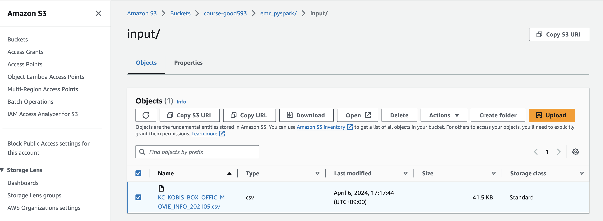
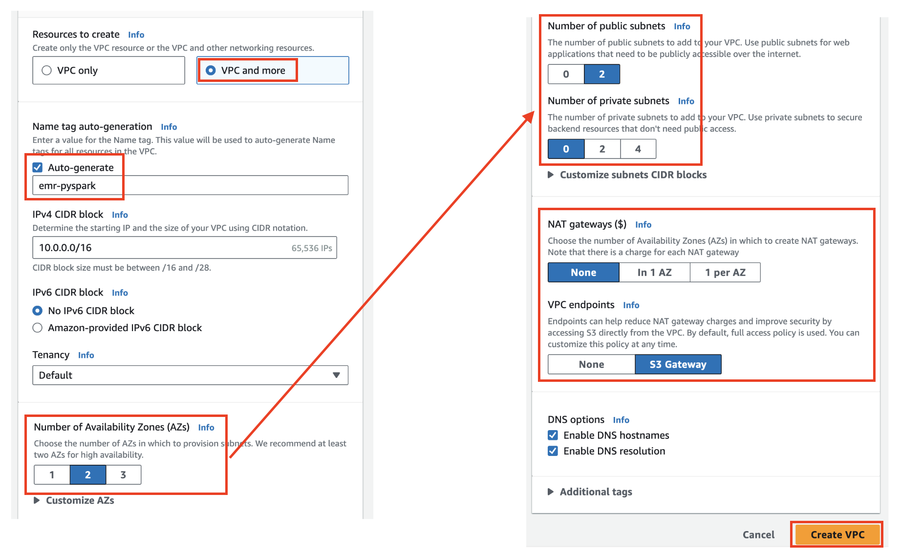

# 사전준비 작업
- AWS 사용자 계정 생성
- S3 버킷 생성 및 테스트 데이터 업로드 

---
# [VPC](https://docs.aws.amazon.com/ko_kr/vpc/latest/userguide/what-is-amazon-vpc.html)
- Amazon VPC (Virtual Private Cloud) 를 사용하면 정의한 논리적으로 격리된 가상 네트워크에서 AWS 리소스를 시작할 수 있습니다.
- VPC는 자체 데이터 센터에서 운영하는 기존 네트워크와 아주 유사한 가상 네트워크입니다. VPC를 생성한 후 서브넷을 추가할 수 있습니다.

### 서브넷
- 서브넷은 VPC의 IP 주소 범위입니다. 서브넷은 단일 가용 영역에 상주해야 합니다. 
- 서브넷을 추가한 후 VPC에 AWS 리소스를 배포할 수 있습니다.

--- 
- 다음 다이어그램에서는 VPC 예를 보여 줍니다. VPC에는 리전의 각 가용성 영역에 하나의 서브넷이 있고, 각 서브넷에 EC2 인스턴스가 있고, VPC의 리소스와 인터넷 간의 통신을 허용하는 인터넷 게이트웨이가 있습니다.

---
### 단계1: VPC 생성

---
### 단계2: 설정

---
### 단계3: 생성된 VPC ID 확인

