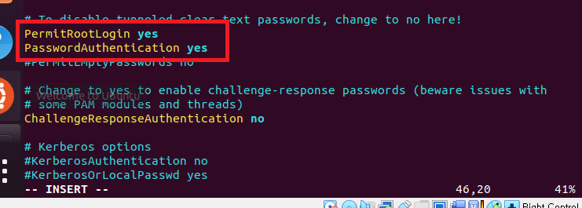
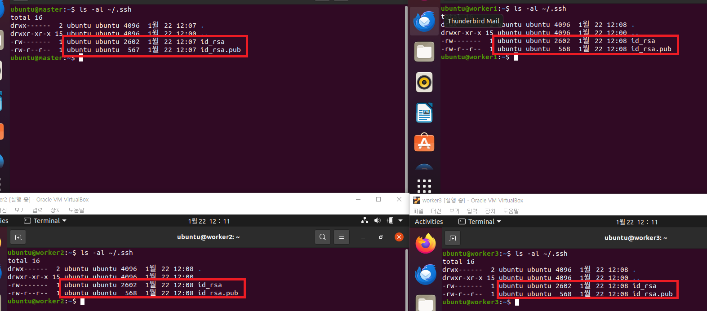

### 단계1: sshd_config 수정 
- worker와 ssh 통신할 때, 비번 생략 설정 
```shell
sudo vim /etc/ssh/sshd_config

# sshd_config파일에서 아래와 같이 수정 
PermitRootLogin yes # (root 로그인 허용여부를 결정함,yes, no, without-password를 사용할 수 있음) 
PasswordAuthentication yes # (열쇠글 인증을 설정하는 것으로 프로토콜 버전 1과 2 모두 적용) 
```


---
- 수정내용적용
```shell
# 재실행 
sudo systemctl restart sshd
# 확인 
systemctl status sshd
```


---
### 단계2: worker 생성
- master를 이용하여 3개의 worker 생성


---
### 단계3: NAT 네트워크 생성 


---
### 단계4: 모두 실행 > NAT 네트워크 적용
- 모두 적용: master, worker1, worker2, worker3


---
### 단계5: 모두 실행 >  hostname 적용 
- 각각 인스턴스명: master, worker1, worker2, worker3
```shell
sudo hostnamectl set-hostname 인스턴스명
hostname
```

-  재기동


---
### 단계6: 모두 실행 > ip 확인 
```shell
ifconfig
``` 


---
### 단계7:  모두 실행 > Hosts 설정
- 각 프라이빗 IPv4 주소 복사 및 적용 
```shell
# hosts 파일 편집
sudo vim /etc/hosts

# 아래 내용처럼 ip주소 추가 후 저장
10.0.2.26 master # 프라이빗 IPv4 주소 복사
10.0.2.27 worker1 # 프라이빗 IPv4 주소 복사
10.0.2.28 worker2 # 프라이빗 IPv4 주소 복사
10.0.2.29 worker3 # 프라이빗 IPv4 주소 복사
```


---
### 단계8: 모두 실행 > ssh-keygen 생성 
```shell
ssh-keygen # enter 3번
cd ~/.ssh
```


---
```shell
ls -al ~/.ssh
```


---
### 단계9: 모두 실행 > ssh public key 교환 작업 
- 입력순서: yes & 비번 
```shell
ssh-copy-id ubuntu@master
ssh-copy-id ubuntu@worker1
ssh-copy-id ubuntu@worker2
ssh-copy-id ubuntu@worker3
```


---
- 결과 확인
```shell
ls -al ~/.ssh
```


---
### 단계10: 모두 실행 >  접속 테스트 
```shell
ssh master
ssh worker1
ssh worker2
ssh worker3
```


