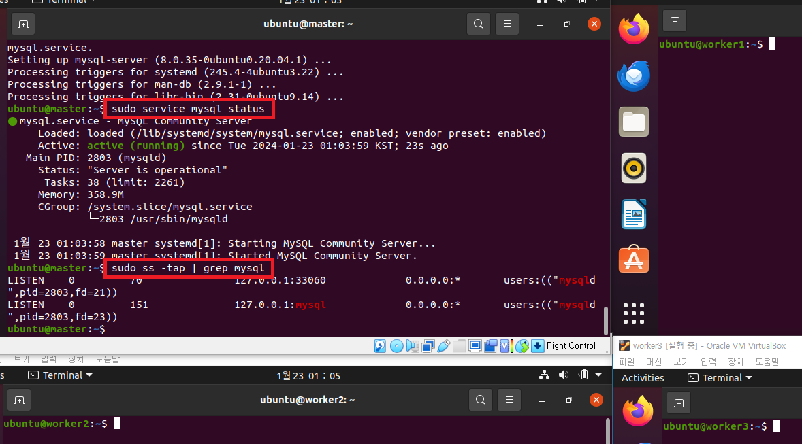
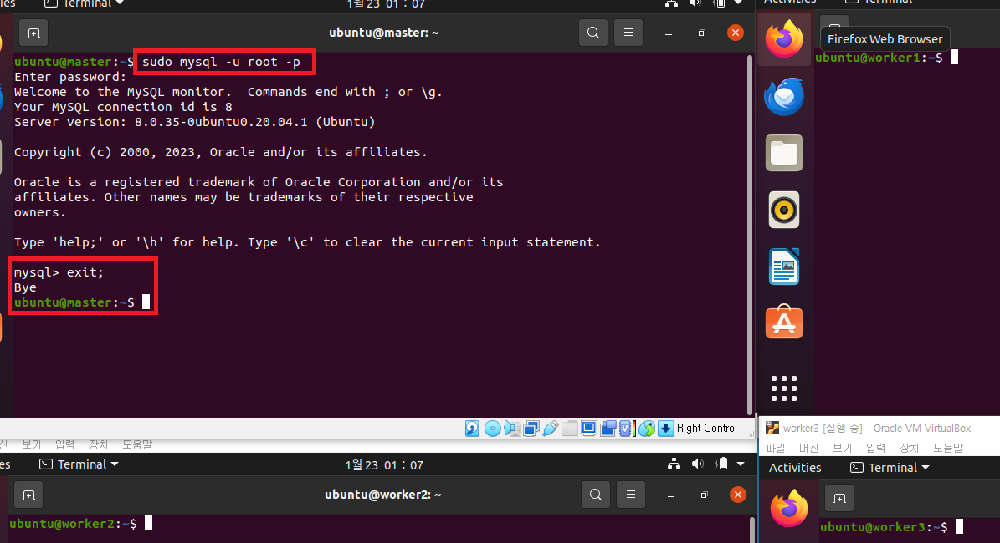
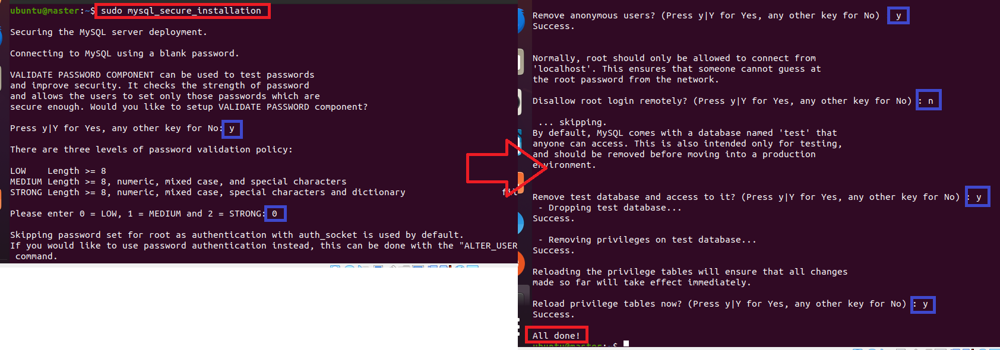
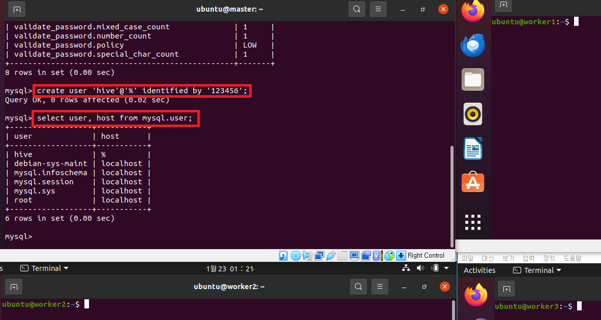
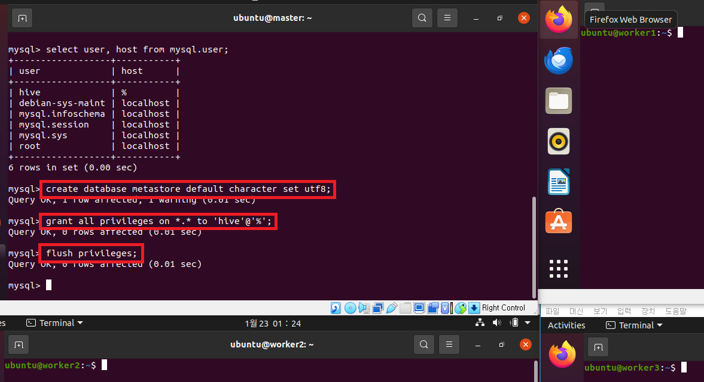
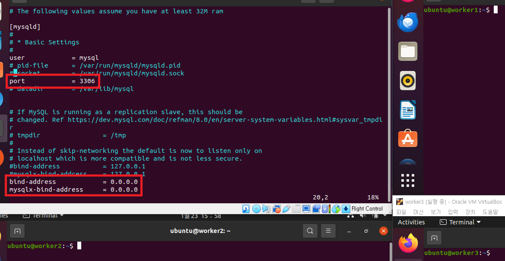
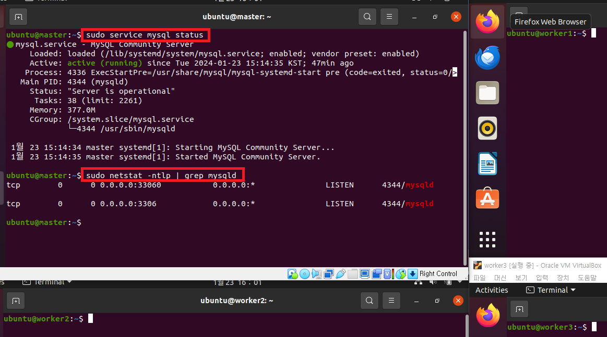

### 단계1: mysql 설치 
```shell
# 설치 
sudo apt-get install mysql-server -y
# 설치 확인 
sudo service mysql status

# 만약 상태값이 active가 아니면, 서버 재실행 
sudo service mysql restart
# 포트 확인
sudo ss -tap | grep mysql 
```
---


---
### 단계2: mysql 접속 
```shell
sudo mysql -u root -p # 초기비번: password
exit; # mysql 나오기 
```


---
### 단계3: 보안설정 
- 입력: y -> 0 -> y -> n -> y -> y
```shell
sudo mysql_secure_installation
```


---
### 단계4: 패스워드 정책변경  
- mysql 접속 
```shell
sudo mysql -u root -p # 초기비번: password
```
- 패스워드 정책변경
```sql
set global validate_password.policy=LOW;
set global validate_password.length=6;
show variables like 'validate_password%';
```
---


---
### 단계5: hive 유저 생성  
```sql
-- 유저 생성
create user 'hive'@'%' identified by '123456';
-- 유저 조회 
select user, host from mysql.user;
```


---
### 단계4: 데이터베이스 생성 및 권한 부여 
- hive에서 사용할 metastore 데이터베이스 생성
```shell
# metastore 데이터베이스 생성 
create database metastore default character set utf8;
# 권한 부여 > sqoop 테스트를 위해서 모든 권한 부여 
grant all privileges on metastore.* to 'hive'@'%';
# 권한 반영 
flush privileges;
```
---


---
### 단계5: hive 유저로 접속 테스트 
- mysql에서 나오기
```sql 
exit;
```
- mysql 접속하기
```shell 
sudo mysql -u hive -p # 비번: 123456
```
---


---
### 단계6: 외부아이피 허용 설정  
```shell
sudo vim /etc/mysql/mysql.conf.d/mysqld.cnf

# 아래내용 입력 
port          = 3306
bind-address            = 0.0.0.0
mysqlx-bind-address     = 0.0.0.0
```
---


---
### 단계7: 외부 아이피 허용 확인
```shell
# 서버 재시작
sudo service mysql restart
# 서버 상태 확인 
sudo service mysql status
# 외부 아이피 허용 확인 
sudo netstat -ntlp | grep mysqld
```
---


---
### 단계8: 내부ip를 이용하여 MySQL 접속
```shell
# 내부 ip 확인 
ifconfig
# 내부 ip를 이용하여 접속 
sudo mysql -u hive -h 10.0.2.15 -P 3306 -p
# 또는 
sudo mysql -u hive -h master -P 3306 -p
```
---


---
### 옵션: MySQL 삭제 
```shell
# mysql 제거 
sudo apt-get purge mysql-client mysql-common mysql-server-core-* mysql-client-core-*
# 관련 폴더 제거 
sudo rm -rf /etc/mysql /var/lib/mysql
sudo apt-get autoremove
sudo apt-get autoclean
```


