# [Lahman 데이터를 이용한 야구 데이터 분석 예제](https://github.com/frrmack/hadoop-python-hive-tutorial/blob/master/hive.md) 
### 단계1: (Github) Master.csv > (ubuntu) Master.csv 


---
### 단계2: 데이터 확인 
```shell
# 파일 확인 
ls 
# 데이터 확인(컬럼명 + 데이터) 
head Master.csv 
```
---
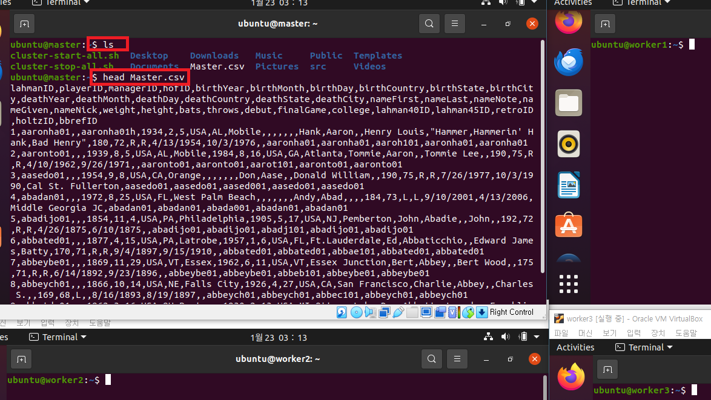

---
- 컬럼명 확인 
```shell
head -n 1 Master.csv | tr ',' '\n'
```
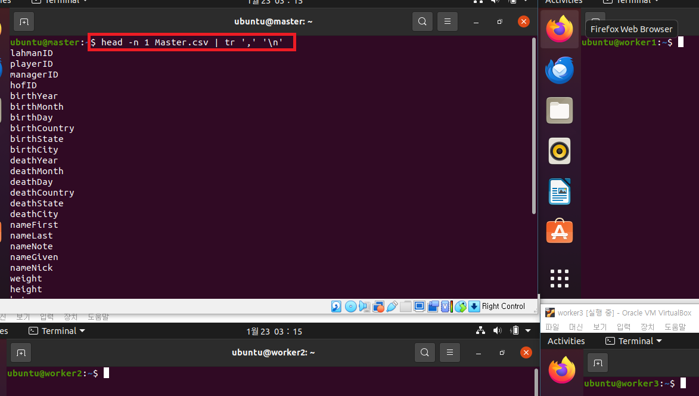

---
- (컬럼명을 제외한)상위 10개 데이터 조회 
```shell
tail -n +2 Master.csv | head
```
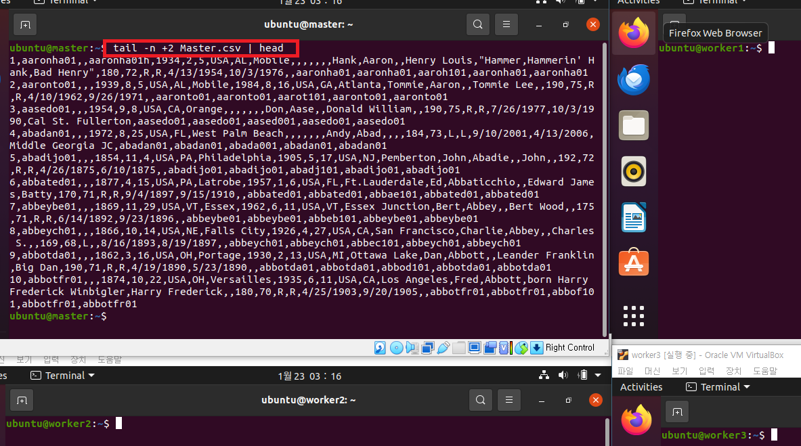

---
### 단계3: baseballdata/Master.csv
- 컬럼을 제외한 데이터 파일 생성 
```shell
tail -n +2 Master.csv > tmp && mv tmp /home/ubuntu/src/data/Master.csv
ls -al /home/ubuntu/src/data
```
---
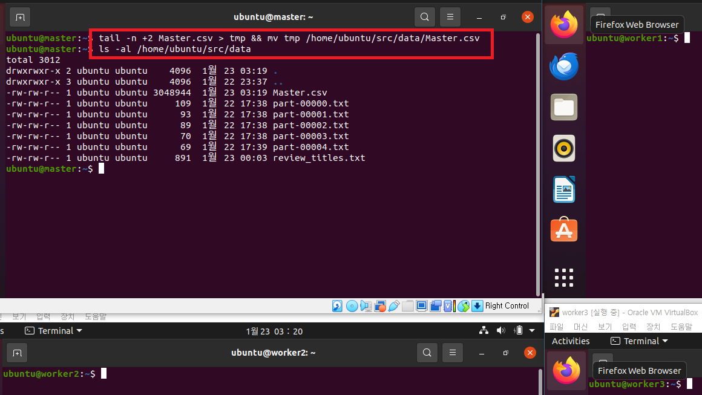

---
### 단계4: hadoop 데이터 전달 
```shell
# hadoop 디렉토리 확인 
hdfs dfs -ls /
# hadoop 디렉토리 생성
hdfs dfs -mkdir -p /hive/baseballdata/input
# hadoop 데이터 전달
hdfs dfs -put /home/ubuntu/src/data/Master.csv /hive/baseballdata/input
# hadoop 데이터 확인 
hdfs dfs -ls -R /hive/baseballdata
```
---
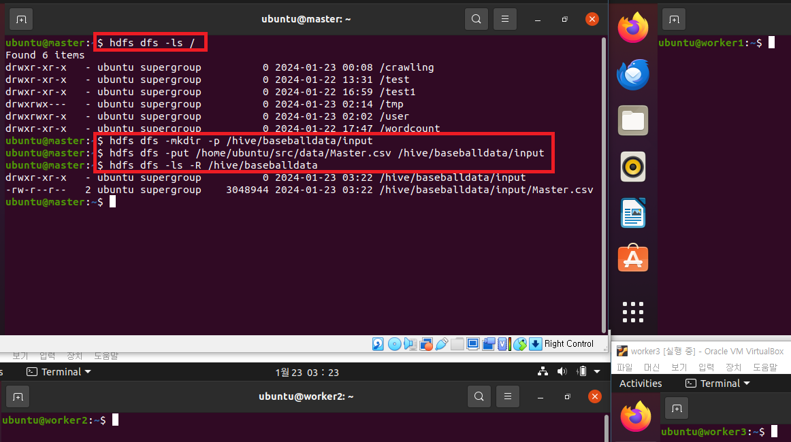

---
### 단계5: Hive > Master 테이블 생성 
```shell
# hive 접속 
hive
# 데이터베이스 생성
create database baseballdata;
use baseballdata;
```
---
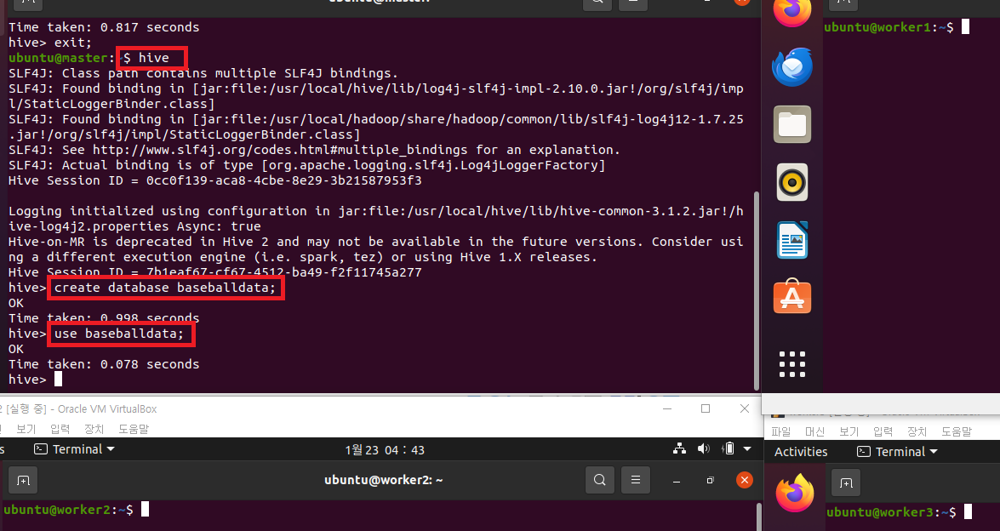

---
- Master 테이블 생성
```sql
CREATE TABLE IF NOT EXISTS Master
(lahmanID INT,
playerID STRING,
managerID STRING,
hofID STRING,
birthYear INT,
birthMonth INT,
birthDay INT,
birthCountry STRING,
birthState STRING,
birthCity STRING,
deathYear INT,
deathMonth INT,
deathDay INT,
deathCountry STRING,
deathState STRING,
deathCity STRING,
nameFirst STRING,
nameLast STRING,
nameNote STRING,
nameGiven STRING,
nameNick STRING,
weight INT,
height INT,
bats STRING,
throws STRING,
debut STRING,
finalGame STRING,
college STRING,
lahman40ID STRING,
lahman45ID STRING,
retroID STRING,
holtzID STRING,
bbrefID STRING)
COMMENT 'Master Player Table'
ROW FORMAT DELIMITED
FIELDS TERMINATED BY ','
STORED AS TEXTFILE;
```
---
```sql
show tables;
```


---
### 단계6: Hive > Upload data
```sql
LOAD DATA INPATH '/hive/baseballdata/input/Master.csv' OVERWRITE INTO TABLE Master;
```


---
### 단계7: Hive > 데이터 조회 
```sql
select * from Master limit 5;
```
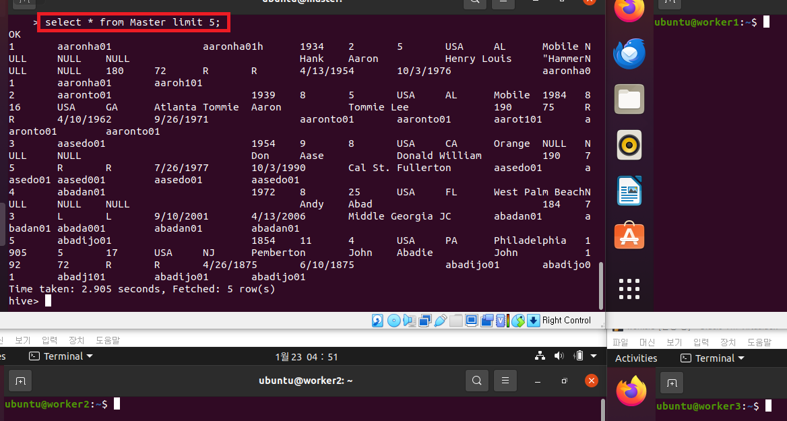

---
```sql
SELECT COUNT(playerid) FROM Master;
```
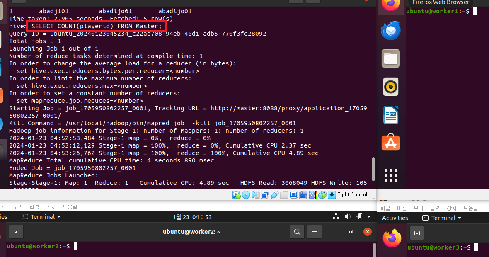

---
```sql
SELECT weight, count(playerID) FROM Master GROUP BY weight;
```
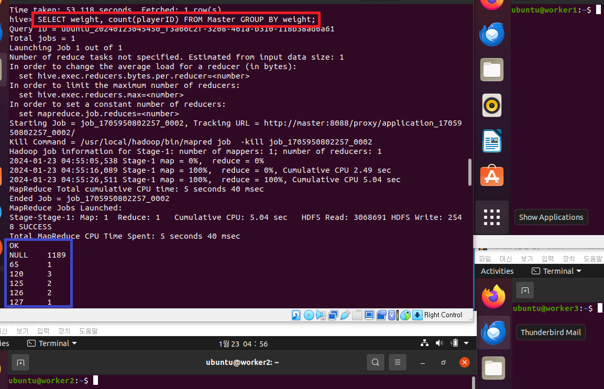

---
### 단계8: Join example in Hive
- Salaries.csv 파일 추가 


---
- 컬럼명 확인 
```shell
head -n 1 Salaries.csv | tr ',' '\n'
```
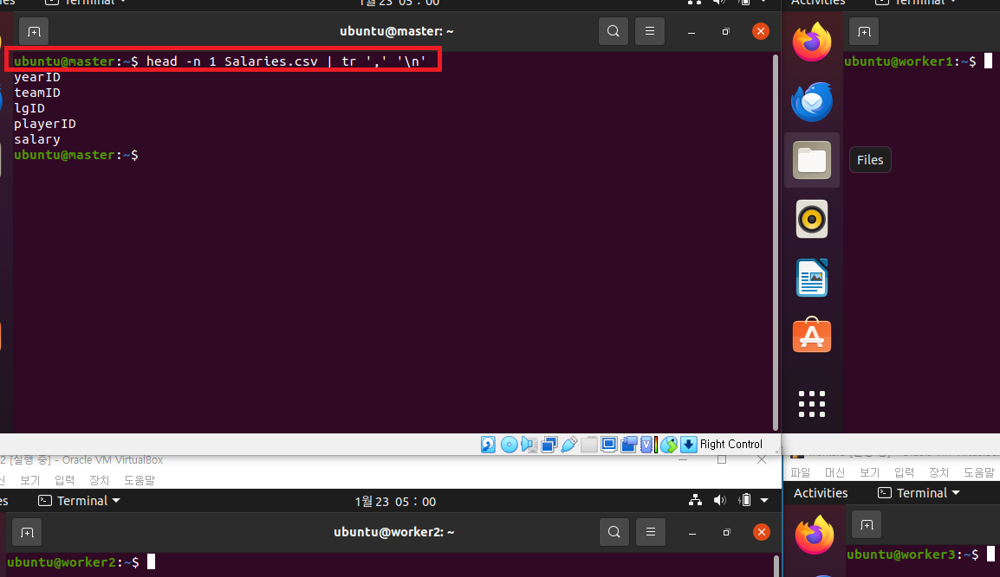

---
- 컬럼데이터를 제외한 파일 생성
```shell
# 컬럼데이터를 제외한 파일 생성 
tail -n +2 Salaries.csv > tmp && mv tmp /home/ubuntu/src/data/Salaries.csv
# 파일 확인 
ls -al /home/ubuntu/src/data
```
---
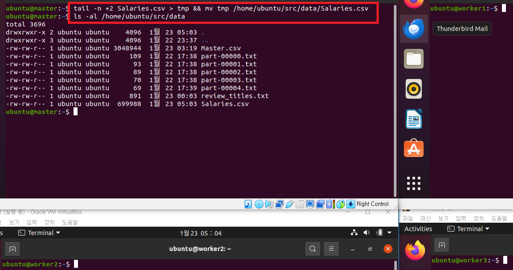

---
- hadoop에 Salaries.csv 파일 추가
```shell
# hadoop 데이터 전달
hdfs dfs -put /home/ubuntu/src/data/Salaries.csv /hive/baseballdata/input
# hadoop 데이터 확인 
hdfs dfs -ls -R /hive/baseballdata
```
---
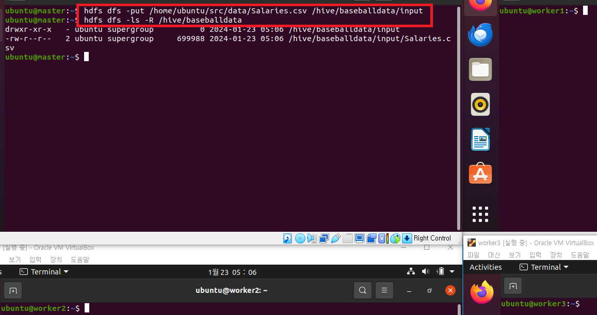

---
- hive 접속 
```shell
hive
```
- 테이블 생성 
```sql
-- 데이터베이스 적용 
use baseballdata;
-- 테이블 생성
CREATE TABLE IF NOT EXISTS Salaries
(yearID INT, teamID STRING, lgID STRING, playerID STRING, salary INT)              
COMMENT 'Salary Table for  Players'                                                 
ROW FORMAT DELIMITED                                                              
FIELDS TERMINATED BY ','                                                           
STORED AS TEXTFILE; 
-- 테이블 리스트 조회 
show tables;
```
---
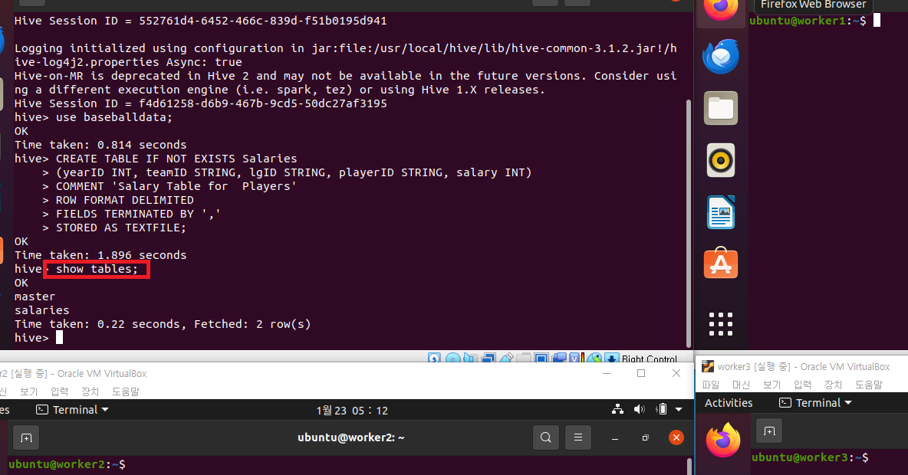

---
- 데이터 삽입
```sql
LOAD DATA INPATH '/hive/baseballdata/input/Salaries.csv' OVERWRITE INTO TABLE Salaries;
select * from Salaries limit 5;
```


---
- Join
```sql
SELECT 
  Salaries.yearID, Master.nameFirst, Master.nameLast, Master.weight, Salaries.salary
FROM Master JOIN Salaries 
  ON (Master.playerID = Salaries.playerID) 
WHERE Master.weight > 270;
```
---
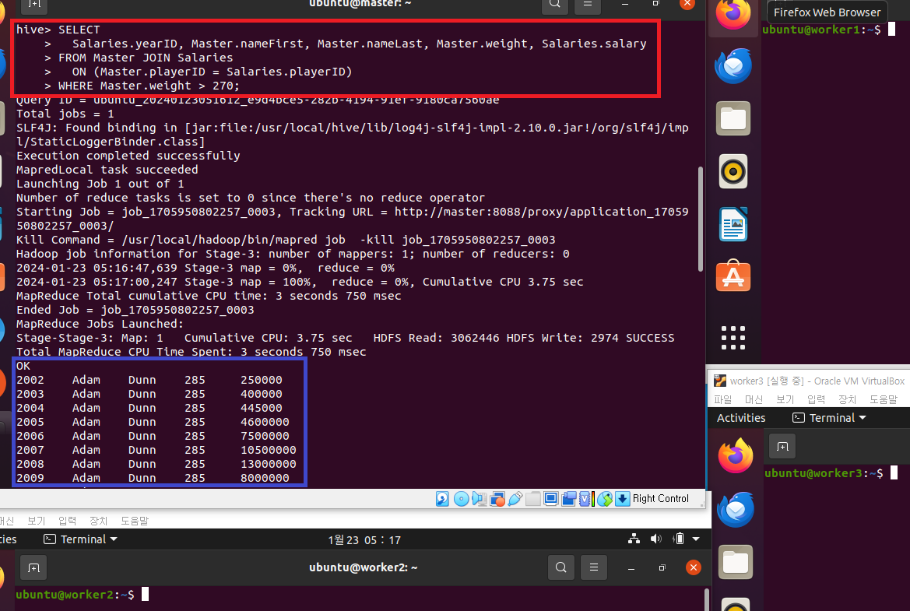

