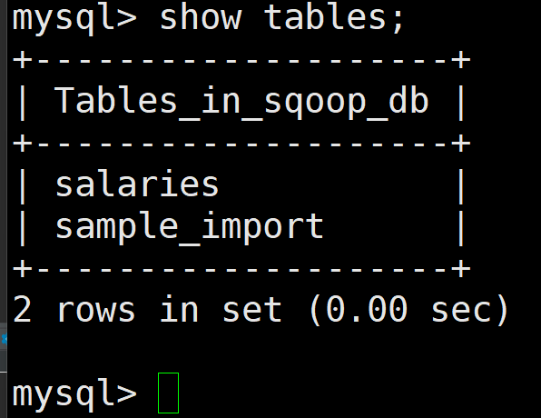
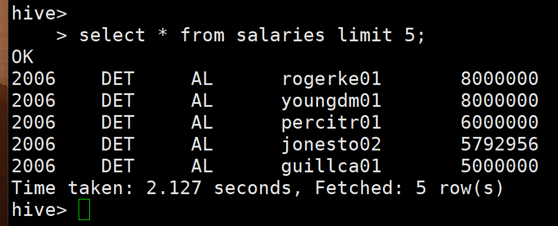

# Sqoop with Hive

---
### 단계1: hive-env.sh
```shell
cp $HIVE_HOME/conf/hive-env.sh.template $HIVE_HOME/conf/hive-env.sh

vim $HIVE_HOME/conf/hive-env.sh
# 아래내용 추가 
HADOOP_HOME=/usr/local/hadoop
export HIVE_CONF_DIR=/usr/local/hive/conf
export HIVE_AUX_JARS_PATH=/usr/local/hive/lib
```


---
### 단계2: hive-common-3.1.2.jar
- sqoop에서 hive에 접속할 수 있게 jar 추가 
```shell
cp /usr/local/hive/lib/hive-common-3.1.2.jar /usr/local/sqoop/lib/hive-common-3.1.2.jar

ls -l $SQOOP_HOME/lib/hive-common-*
```


---
### 단계3: 테이블 생성 on MySQL
- mysql 접속 
```shell
mysql -u hive -p
```
- 테이블 생성 
```sql
use sqoop;

create table salaries (
	yearid int,
	teamid varchar(10),
	lgid varchar(10),
	playerid varchar(50),
	salary int
);
```


---
### 단계4: Salaries.csv
- 만약 파일이 없다면, Salaries.csv 파일 추가 
```shell
# 파일 다운로드 
sudo wget https://raw.githubusercontent.com/good593/course_data_engineering/main/hadoop%20ecosystem/samples/5.%20Hive%20with%20MySQL/Salaries.csv
# 컬럼 제거 
tail -n +2 Salaries.csv > tmp && mv tmp Salaries_data.csv

ls 
```


---
### 단계5: put data to hadoop
```shell
# 만약 없다면, 디렉토리 생성 
hdfs dfs -mkdir -p /sqoop/export
# hadoop 데이터 전달
hdfs dfs -put Salaries_data.csv /sqoop/export/Salaries_data.csv
# hadoop 데이터 확인 
hdfs dfs -ls -R /sqoop/export
```


---
### 단계6: export to mysql
```shell
sqoop export  \
--driver "com.mysql.cj.jdbc.Driver" \
--connect "jdbc:mysql://master:3306/sqoop?useSSL=false&allowPublicKeyRetrieval=true&characterEncoding=UTF-8&serverTimezone=UTC" \
--username hive \
--password 123456 \
--table salaries \
--export-dir /sqoop/export/Salaries_data.csv \
--input-fields-terminated-by ',' \
--input-lines-terminated-by '\n'
```
---
- mysql 접속
```shell
mysql -u hive -p
```
- 결과 확인 
```sql
select * from salaries limit 5;
```


---
### 단계6: [import to hive](https://til.songyunseop.com/data/import_rdbms_data_to_hive_with_sqoop) 
- 데이터베이스 생성 on hive
```sql
create database sqoop;
show databases;
```
- import to hive
```shell
sqoop import  \
--driver "com.mysql.cj.jdbc.Driver" \
--connect "jdbc:mysql://master:3306/sqoop?useSSL=false&allowPublicKeyRetrieval=true&characterEncoding=UTF-8&serverTimezone=UTC" \
--username hive \
--password 123456 \
--columns yearid,teamid,lgid,playerid,salary \
--table salaries \
--fields-terminated-by "," \
--target-dir /sqoop/import/hive/raw/salaries  \
--hive-import \
--create-hive-table \
--hive-table sqoop.salaries \
-m 1
```
---
- 결과 확인 on hive 
```sql
use sqoop;

select * from salaries limit 5;
```



