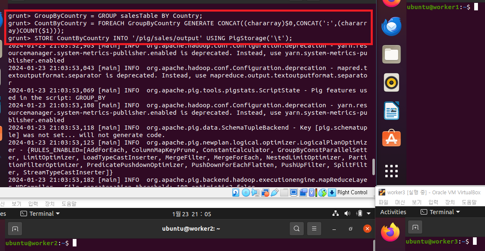
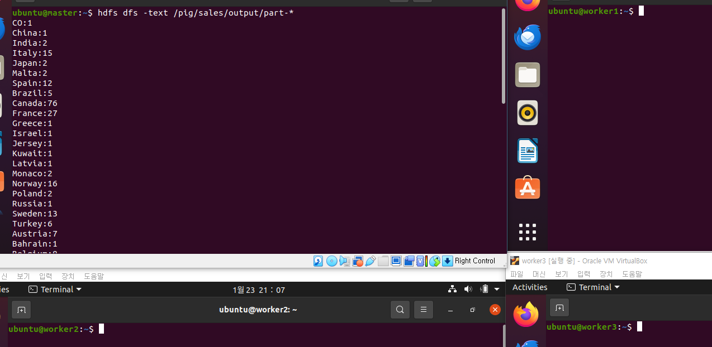

# [SalesJan2009 데이터 다운로드](https://www.guru99.com/ko/introduction-to-pig-and-hive.html) 
### 단계1: 우분투에 SalesJan2009 저장
```shell
sudo wget https://raw.githubusercontent.com/good593/course_data_engineering/main/hadoop%20ecosystem/samples/7.%20Pig%20%EC%82%AC%EC%9A%A9%ED%95%98%EA%B8%B0/SalesJan2009.csv
```


---
### 단계2: 하둡에 SalesJan2009 저장
```shell
hdfs dfs -mkdir -p /pig/sales/input

# hadoop 데이터 전달
hdfs dfs -put SalesJan2009.csv /pig/sales/input

# hadoop 데이터 확인 
hdfs dfs -ls -R /pig/sales
```
---


---
### 단계3: pig에 데이터 로드 
```shell
# 접속
pig

# 데이터 로드 
rawSalesTable = LOAD '/pig/sales/input/SalesJan2009.csv' USING PigStorage(',') 
AS (Transaction_date:chararray,Product:chararray,Price:chararray,Payment_Type:chararray,
Name:chararray,City:chararray,State:chararray,Country:chararray,Account_Created:chararray,
Last_Login:chararray,Latitude:chararray,Longitude:chararray);

# 공백 제거 
salesTable = FOREACH rawSalesTable GENERATE 
TRIM(Transaction_date) as Transaction_date, TRIM(Product) as Product, TRIM(Price) as Price, TRIM(Payment_Type) as Payment_Type
, TRIM(Name) as Name, TRIM(City) as City, TRIM(State) as State, TRIM(Country) as Country, TRIM(Account_Created) as Account_Created
, TRIM(Last_Login) as Last_Login, TRIM(Latitude) as Latitude, TRIM(Longitude) as Longitude;

# 데이터 출력
DUMP salesTable;
```
---


---
# 문제1
- 국가별 제품 판매 수 조회 

---
### 단계1: 국가별 필드별 데이터 그룹화
```shell
GroupByCountry = GROUP salesTable BY Country;
```
### 단계2: 각 튜플에 대해 '그룹별국가', 양식-> 국가 이름: 판매된 제품 수의 결과 문자열을 생성합니다.
```shell
CountByCountry = FOREACH GroupByCountry GENERATE CONCAT((chararray)$0,CONCAT(':',(chararray)COUNT($1)));
```
### 단계3: Data Flow의 결과를 디렉터리에 저장합니다.
```shell
STORE CountByCountry INTO '/pig/sales/output' USING PigStorage('\t');
```
---


---
### 단계4: 결과 데이터 확인 
```shell
hdfs dfs -text /pig/sales/output/part-*
```


---
# 문제2
- 상품별 가장 많이 판매된 나라이름과, 가장 적게 판매된 나라이름 조회

---
### 단계1: 상품 및 나라별 필드별 데이터 그룹화
```shell
GroupByProduct = GROUP salesTable BY (Product,Country);
```
### 단계2: 그룹화된 데이터의 수 조회 
```shell
CountByGroup = FOREACH GroupByProduct 
GENERATE (chararray)group.Product, (chararray)group.Country, COUNT(salesTable) as CNT;
```
---
### 단계3: Min/Max Count 구하기 
```shell
CnTMinByProduct = FOREACH (GROUP CountByGroup by Product) 
GENERATE group as Product, MIN(CountByGroup.CNT) as cnt_min;

CnTMaxByProduct = FOREACH (GROUP CountByGroup by Product) 
GENERATE group as Product, MAX(CountByGroup.CNT) as cnt_max;
```
### 단계4: Min/Max Count 추가하기  
```shell
JoinByProduct = FOREACH (JOIN CnTMinByProduct BY Product, CnTMaxByProduct BY Product)
GENERATE $0 as Product, $1 as cnt_min, $3 as cnt_max;
```
---
### 단계5: Min/Max Country 구하기
```shell
tmp = FOREACH (JOIN CountByGroup BY Product LEFT OUTER, JoinByProduct BY Product)
GENERATE $0 as Product, $1 as Country, $2 as cnt , $4 as cnt_min, $5 as cnt_max;

CountryMinByProduct = FOREACH (FILTER tmp By cnt == cnt_min)
GENERATE  $0 as Product, $1 as Country_min;

CountryMaxByProduct = FOREACH (FILTER tmp By cnt == cnt_max)
GENERATE  $0 as Product, $1 as Country_max;
```
---
### 단계6: Product별 Min/Max Country 구하기
```shell
GroupByCountryMin = FOREACH (GROUP (DISTINCT CountryMinByProduct) BY Product)
GENERATE  $0 as Product, $1 as CountryMinByProduct;

GroupByCountryMax = FOREACH (GROUP (DISTINCT CountryMaxByProduct) BY Product)
GENERATE  $0 as Product, $1 as CountryMaxByProduct;
```
### 단계7: Product별 Min/Max Country 합치기 
```shell
RawResult = FOREACH (JOIN GroupByCountryMin BY Product, GroupByCountryMax BY Product)
GENERATE $0 as Product, 
BagToString(CountryMinByProduct.Country_min,'/') as country_min, 
BagToString(CountryMaxByProduct.Country_max,'/') as country_max;
```
---
### 단계8: 상품별 가장 많이 판매된 나라이름과, 가장 적게 판매된 나라이름 조회 
```shell
Result = FOREACH RawResult
GENERATE Product, CONCAT('country_min: ', country_min), CONCAT('country_max: ', country_max);

dump Result;
```


