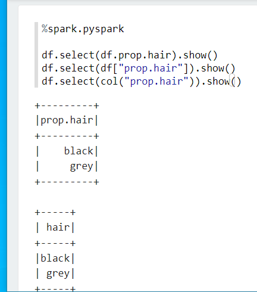
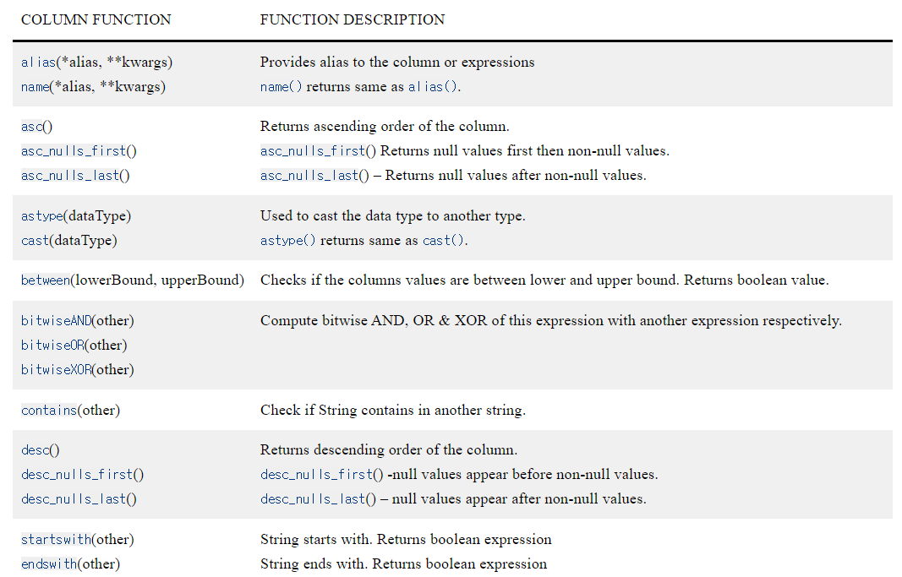
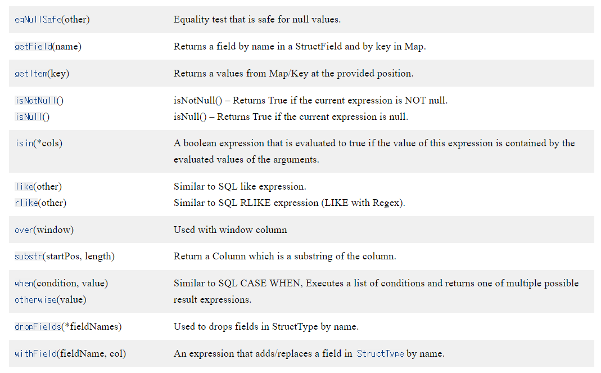
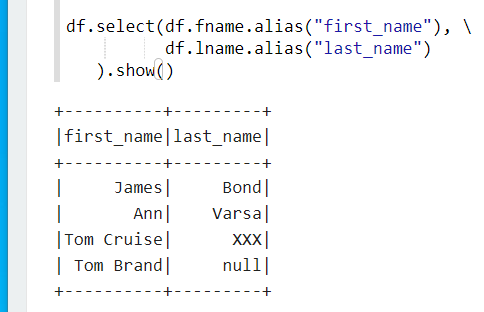
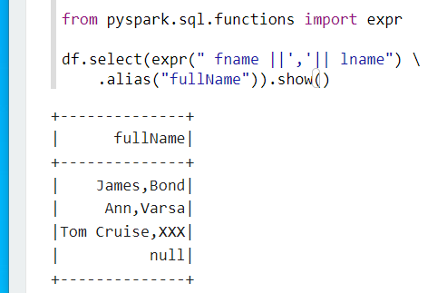

# Create SparkContext
```python
%spark.pyspark

import pyspark
from pyspark.sql import SparkSession
spark = SparkSession.builder.master("yarn") \
                    .appName('SparkByExamples.com') \
                    .getOrCreate()
                    
print(spark.sparkContext)
print("Spark App Name : "+ spark.sparkContext.appName)
```


---
# [PySpark Column Class](https://sparkbyexamples.com/pyspark/pyspark-column-functions/)

---
### 단계1: 예제1
- Create DataFrame
```python
%spark.pyspark

data=[("James",23),("Ann",40)]
df=spark.createDataFrame(data).toDF("name.fname","gender")
df.printSchema()
```
---
- Accessing column Using DataFrame object (df)
```python
%spark.pyspark

df.select(df.gender).show()
```


---
- Accessing column name with dot (with backticks)
```python
%spark.pyspark

df.select(df["gender"]).show()
```


---
- Using SQL col() function
```python
%spark.pyspark

from pyspark.sql.functions import col
df.select(col("gender")).show()
```


---
### 단계2: 예제2
- Create DataFrame
```python
%spark.pyspark

from pyspark.sql import Row
data=[Row(name="James",prop=Row(hair="black",eye="blue")),
      Row(name="Ann",prop=Row(hair="grey",eye="black"))]
df=spark.createDataFrame(data)
df.show()
df.printSchema()
```
---


---
- Access struct column
```python
%spark.pyspark

df.select(df.prop.hair).show()
df.select(df["prop.hair"]).show()
df.select(col("prop.hair")).show()
```


---
- Access all columns from struct
```python
%spark.pyspark

df.select(col("prop.*")).show()
```


---
## PySpark Column Operators

---
### 단계1: Create DataFrame
```python
%spark.pyspark

data=[(100,2,1),(200,3,4),(300,4,4)]
df=spark.createDataFrame(data).toDF("col1","col2","col3")

df.show()
df.printSchema()
```
---
### 단계2: Arthmetic operations
```python
%spark.pyspark

df.select(df.col1 + df.col2).show()
df.select(df.col1 - df.col2).show() 
df.select(df.col1 * df.col2).show()
df.select(df.col1 / df.col2).show()
df.select(df.col1 % df.col2).show()

df.select(df.col2 > df.col3).show()
df.select(df.col2 < df.col3).show()
df.select(df.col2 == df.col3).show()
```
---
## PySpark Column Functions


---


---
### 단계1: Create DataFrame
```python
%spark.pyspark

data=[("James","Bond","100",None),
      ("Ann","Varsa","200",'F'),
      ("Tom Cruise","XXX","400",''),
      ("Tom Brand",None,"400",'M')] 
columns=["fname","lname","id","gender"]
df=spark.createDataFrame(data,columns)
df.printSchema()
```


---
### 단계2: alias() 
- Set’s name to Column
```python
%spark.pyspark

df.select(df.fname.alias("first_name"), \
          df.lname.alias("last_name")
   ).show()
```


---
- Another example
```python
%spark.pyspark

from pyspark.sql.functions import expr

df.select(expr(" fname ||','|| lname") \
    .alias("fullName")).show()
```


---
### 단계3: asc() & desc() 
- Sort the DataFrame columns by Ascending or Descending order.
```python
%spark.pyspark

df.sort(df.fname.asc()).show()
df.sort(df.fname.desc()).show()
```
### 단계4: cast() & astype() 
- Used to convert the data Type.
```python
%spark.pyspark

df.select(df.fname,df.id.cast("int")).printSchema()
```
---
### 단계5: between() 
- Returns a Boolean expression when a column values in between lower and upper bound.
```python
%spark.pyspark

df.filter(df.id.between(100,300)).show()
```
### 단계6: contains()
```python
%spark.pyspark

df.filter(df.fname.contains("Cruise")).show()
```
---
### 단계7: startswith() & endswith()
```python
%spark.pyspark

df.filter(df.fname.startswith("T")).show()
df.filter(df.fname.endswith("Cruise")).show()
```
### 단계8: isNull & isNotNull() 
- Checks if the DataFrame column has NULL or non NULL values.
```python
%spark.pyspark

df.filter(df.lname.isNull()).show()
df.filter(df.lname.isNotNull()).show()
```
---
### 단계9: like() & rlike() 
- Similar to SQL LIKE expression
```python
%spark.pyspark

df.select(df.fname,df.lname,df.id) \
  .filter(df.fname.like("%es")).show() 
```
### 단계10: substr() 
- Returns a Column after getting sub string from the Column
```python
%spark.pyspark

df.select(df.fname.substr(1,2).alias("substr")).show() 
```
---
### 단계11: when() & otherwise() 
- It is similar to SQL Case When, executes sequence of expressions until it matches the condition and returns a value when match.
```python
%spark.pyspark

from pyspark.sql.functions import when
df.select(df.fname,df.lname,when(df.gender=="M","Male") \
              .when(df.gender=="F","Female") \
              .when(df.gender.isNull() ,"is_null") \
              .otherwise(df.gender).alias("new_gender") \
    ).show()
```
### 단계12: isin() 
- Check if value presents in a List.
```python
%spark.pyspark

li=["100","200"]
df.select(df.fname,df.lname,df.id) \
  .filter(df.id.isin(li)) \
  .show()
```
---
### 단계13: getField() 
```python
%spark.pyspark

from pyspark.sql.types import StructType,StructField,StringType,ArrayType,MapType
data=[(("James","Bond"),["Java","C#"],{'hair':'black','eye':'brown'}),
      (("Ann","Varsa"),[".NET","Python"],{'hair':'brown','eye':'black'}),
      (("Tom Cruise",""),["Python","Scala"],{'hair':'red','eye':'grey'}),
      (("Tom Brand",None),["Perl","Ruby"],{'hair':'black','eye':'blue'})]

schema = StructType([
        StructField('name', StructType([
            StructField('fname', StringType(), True),
            StructField('lname', StringType(), True)])),
        StructField('languages', ArrayType(StringType()),True),
        StructField('properties', MapType(StringType(),StringType()),True)
     ])
df=spark.createDataFrame(data,schema)
df.show()
df.printSchema()
```
---
- To get the value by key from MapType column and by stuct child name from StructType column
```python
%spark.pyspark
#getField from MapType
df.select(df.properties.getField("hair")).show()

#getField from Struct
df.select(df.name.getField("fname")).show()
```
---
### 단계14: getItem() 
- To get the value by index from MapType or ArrayTupe & ny key for MapType column.
```python
%spark.pyspark
#getItem() used with ArrayType
df.select(df.languages.getItem(1)).show()

#getItem() used with MapType
df.select(df.properties.getItem("hair")).show()
```
---
## [PySpark Select Columns](https://sparkbyexamples.com/pyspark/select-columns-from-pyspark-dataframe/)
```python
%spark.pyspark

data = [("James","Smith","USA","CA"),
    ("Michael","Rose","USA","NY"),
    ("Robert","Williams","USA","CA"),
    ("Maria","Jones","USA","FL")
  ]
columns = ["firstname","lastname","country","state"]
df = spark.createDataFrame(data = data, schema = columns)
df.show(truncate=False)
```

---
### 단계1: Select Single & Multiple Columns
```python
%spark.pyspark

df.select("firstname","lastname").show()
df.select(df.firstname,df.lastname).show()
df.select(df["firstname"],df["lastname"]).show()

#By using col() function
from pyspark.sql.functions import col
df.select(col("firstname"),col("lastname")).show()

#Select columns by regular expression
df.select(df.colRegex("`^.*name*`")).show()
```
---
### 단계2: Select All Columns From List
```python
%spark.pyspark

# Select All columns from List
columns = ["firstname","lastname","country","state"]
df.select(*columns).show()

# Select All columns
df.select([col for col in df.columns]).show()
df.select("*").show()
```
---
### 단계3: Select Columns by Index
```python
%spark.pyspark

#Selects first 3 columns and top 3 rows
df.select(df.columns[:3]).show(3)

#Selects columns 2 to 4  and top 3 rows
df.select(df.columns[2:4]).show(3)
```
---
### 단계4: Select Nested Struct Columns
```python
%spark.pyspark

data = [
        (("James",None,"Smith"),"OH","M"),
        (("Anna","Rose",""),"NY","F"),
        (("Julia","","Williams"),"OH","F"),
        (("Maria","Anne","Jones"),"NY","M"),
        (("Jen","Mary","Brown"),"NY","M"),
        (("Mike","Mary","Williams"),"OH","M")
        ]

from pyspark.sql.types import StructType,StructField, StringType        
schema = StructType([
    StructField('name', StructType([
         StructField('firstname', StringType(), True),
         StructField('middlename', StringType(), True),
         StructField('lastname', StringType(), True)
         ])),
     StructField('state', StringType(), True),
     StructField('gender', StringType(), True)
     ])
df2 = spark.createDataFrame(data = data, schema = schema)
df2.printSchema()
df2.show(truncate=False) # shows all columns
```
---
- This returns struct column name as is.
```python
%spark.pyspark

df2.select("name").show(truncate=False)
```
- This outputs firstname and lastname from the name struct column.
```python
%spark.pyspark

df2.select("name.firstname","name.lastname").show(truncate=False)
```
- In order to get all columns from struct column.
```python
%spark.pyspark

df2.select("name.*").show(truncate=False)
```
---
## [PySpark Collect()](https://sparkbyexamples.com/pyspark/pyspark-collect/)
```python
%spark.pyspark

dept = [("Finance",10), \
    ("Marketing",20), \
    ("Sales",30), \
    ("IT",40) \
  ]
deptColumns = ["dept_name","dept_id"]
deptDF = spark.createDataFrame(data=dept, schema = deptColumns)
deptDF.show(truncate=False)
```
---
### 단계1: 예제
```python
%spark.pyspark

dataCollect = deptDF.collect()
print(dataCollect)
```
### 단계2: 예제
```python
%spark.pyspark

for row in dataCollect:
    print(row['dept_name'] + "," +str(row['dept_id']))
```
---
### 단계3: 예제
```python
%spark.pyspark

print(deptDF.collect()[0][0])
print(deptDF.collect()[0][1])
print(deptDF.collect()[1][0])
```
### 단계4: 예제
```python
%spark.pyspark

dataCollect = deptDF.select("dept_name").collect()
dataCollect
```
---
## [PySpark withColumn() Usage](https://sparkbyexamples.com/pyspark/pyspark-withcolumn/)
```python
%spark.pyspark

data = [('James','','Smith','1991-04-01','M',3000),
  ('Michael','Rose','','2000-05-19','M',4000),
  ('Robert','','Williams','1978-09-05','M',4000),
  ('Maria','Anne','Jones','1967-12-01','F',4000),
  ('Jen','Mary','Brown','1980-02-17','F',-1)
]

columns = ["firstname","middlename","lastname","dob","gender","salary"]
from pyspark.sql import SparkSession
spark = SparkSession.builder.appName('SparkByExamples.com').getOrCreate()
df = spark.createDataFrame(data=data, schema = columns)
df.show()
```
---
### 단계1: Change DataType using PySpark
```python
%spark.pyspark

df.withColumn("salary",col("salary").cast("Integer")).show()
```
### 단계2: Update The Value of an Existing Column
```python
%spark.pyspark

df.withColumn("salary",col("salary")*100).show()
```
---
### 단계3: Create a Column from an Existing
```python
%spark.pyspark

df.withColumn("CopiedColumn",col("salary")* -1).show()
```
### 단계4: Add a New Column using withColumn()
```python
%spark.pyspark

from pyspark.sql.functions import lit

df.withColumn("Country", lit("USA")).show()
df.withColumn("Country", lit("USA")) \
  .withColumn("anotherColumn",lit("anotherValue")) \
  .show()
```
---
### 단계5: Rename Column Name
```python
%spark.pyspark

df.withColumnRenamed("gender","sex") \
  .show(truncate=False) 
```
### 단계6: Drop Column From PySpark DataFrame
```python
%spark.pyspark

df.drop("salary") \
  .show() 
```


