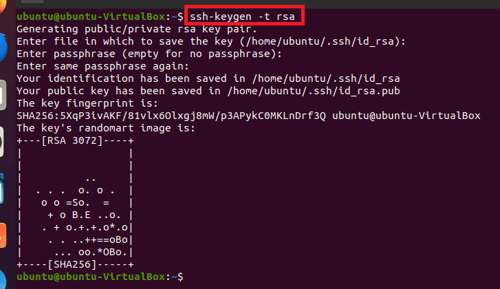
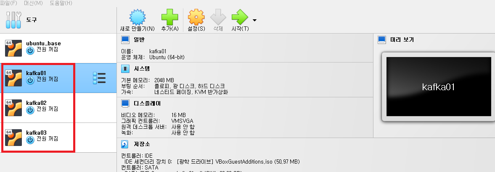
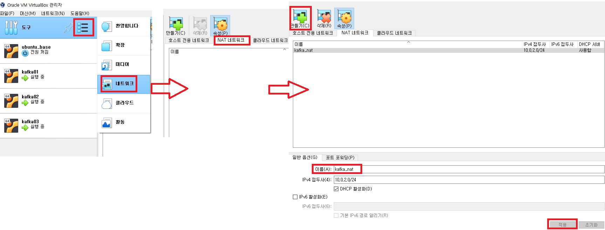
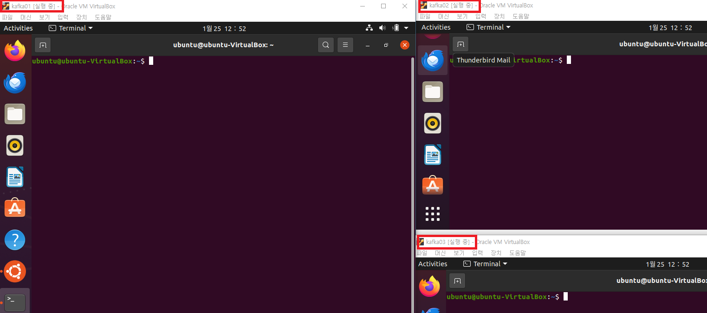
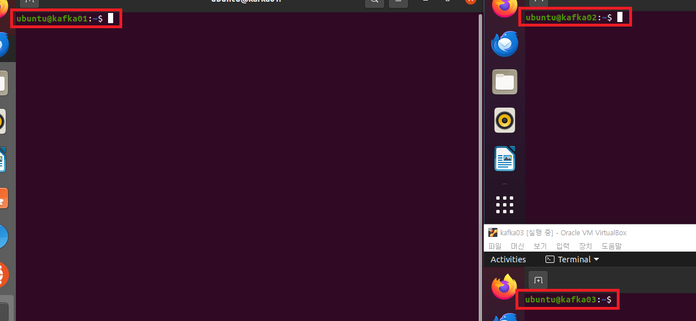
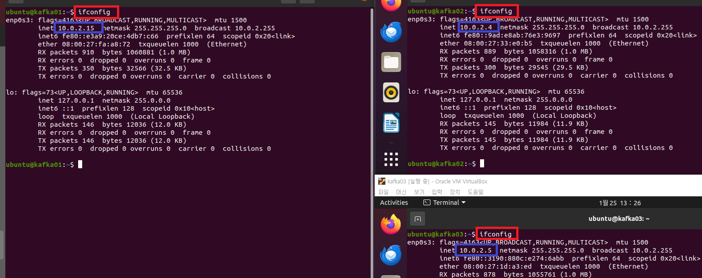
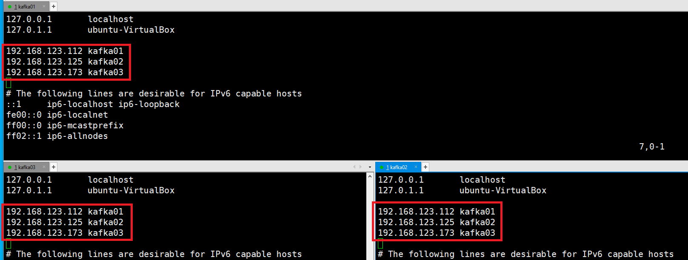
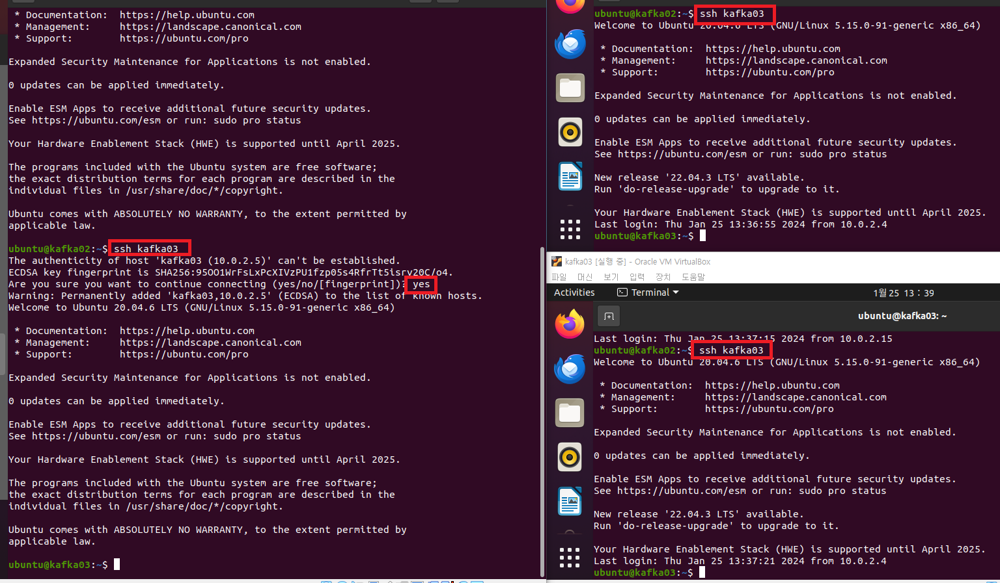
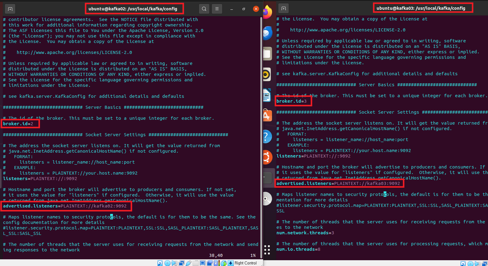

### 단계1: ssh-keygen 생성 
```shell
ssh-keygen -t rsa # enter 3번 
```


---
### 단계2: authorized_keys 생성
```shell
cd ~/.ssh
cat >> ~/.ssh/authorized_keys < ~/.ssh/id_rsa.pub

cat authorized_keys
ls
```


---
- sshd_config 수정 
  - worker와 ssh 통신할 때, 비번 생략 설정 
```shell
sudo vim /etc/ssh/sshd_config

# sshd_config파일에서 아래와 같이 수정 
PermitRootLogin yes # (root 로그인 허용여부를 결정함,yes, no, without-password를 사용할 수 있음) 
PasswordAuthentication yes # (열쇠글 인증을 설정하는 것으로 프로토콜 버전 1과 2 모두 적용) 
```

---
### 단계3: kafka02, kafka03 생성
- kafka01을 종료한 후 복제하여 생성 



---
### 단계5: NAT 네트워크 생성 
- 이름: kafka_nat



---
### 단계6: NAT 네트워크 적용 


---
### 단계4: kafka01, kafka02, kafka03 실행 


---
### 단계5: hostname 정의 후 재실행
```shell
# kafka01 인스턴스
sudo hostnamectl set-hostname kafka01
hostname
# kafka02 인스턴스
sudo hostnamectl set-hostname kafka02
hostname
# kafka03 인스턴스
sudo hostnamectl set-hostname kafka03
hostname
```
---
- hostname 정의


---
- 재실행


---
### 단계5: 각 인스턴스의 ip 확인 
```shell
ifconfig
```


---
### 단계5: hosts 파일 수정 
```shell
sudo vim /etc/hosts

# kafka01용 
0.0.0.0 kafka01 # 자신의 host명 
10.0.2.7 kafka02
10.0.2.8 kafka03

# kafka02용 
10.0.2.15 kafka01  
0.0.0.0 kafka02 # 자신의 host명
10.0.2.8 kafka03

# kafka03용 
10.0.2.15 kafka01 
10.0.2.7 kafka02
0.0.0.0 kafka03 # 자신의 host명
```
---


---
### 단계6: ssh 접속 테스트 
```shell
ssh kafka01
# Are you sure you want to continue connecting (yes/no/[fingerprint])? yes
ssh kafka02
# Are you sure you want to continue connecting (yes/no/[fingerprint])? yes
ssh kafka03
# Are you sure you want to continue connecting (yes/no/[fingerprint])? yes
```
---


---
### 단계7: zookeeper의 myid 수정 
```shell
# kafka01
cat /usr/local/zookeeper/data/myid

# kafka02
echo 2 > /usr/local/zookeeper/data/myid
cat /usr/local/zookeeper/data/myid

# kafka03
echo 3 > /usr/local/zookeeper/data/myid
cat /usr/local/zookeeper/data/myid
```
---


---
### 단계8: server.properties 수정
- kafka02
```shell
vim $KAFKA_HOME/config/server.properties

# 아래내용 수정 
broker.id=2  
advertised.listeners=PLAINTEXT://kafka02:9092
```
- kafka03
```shell
vim $KAFKA_HOME/config/server.properties 

# 아래내용 수정 
broker.id=3  
advertised.listeners=PLAINTEXT://kafka03:9092
```
---



