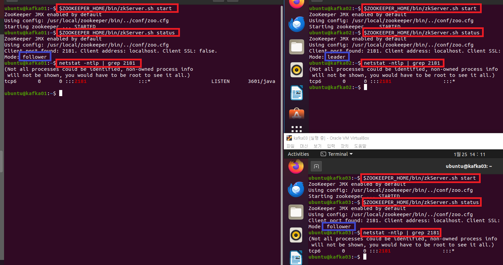
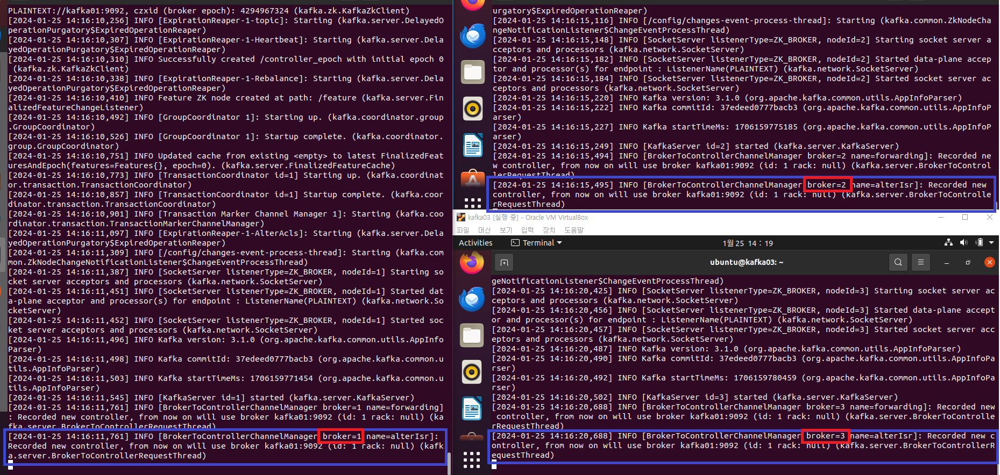
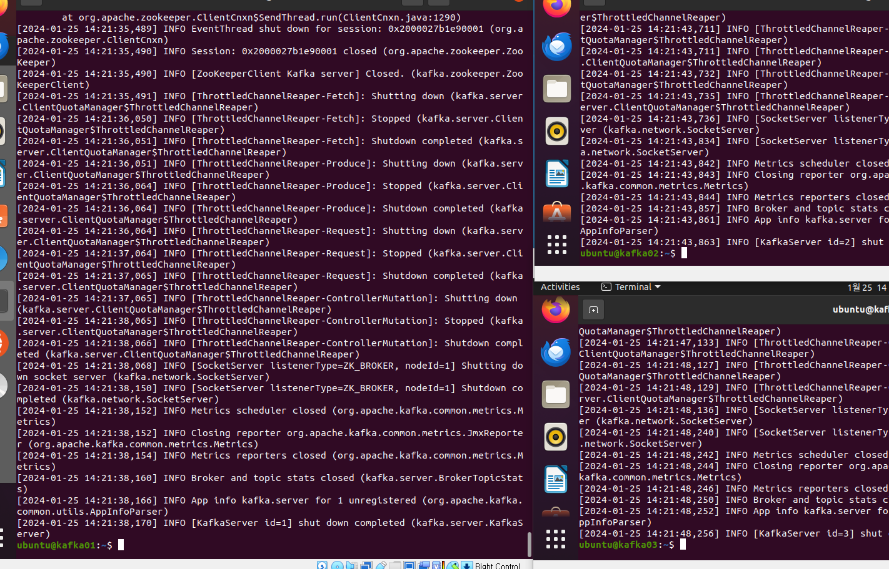
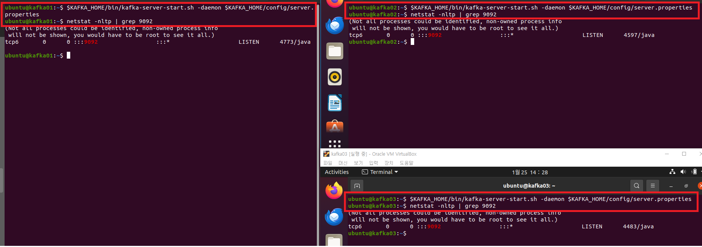

### 단계1: zookeeper 실행 
```shell
# 실행
$ZOOKEEPER_HOME/bin/zkServer.sh start
# 확인 
$ZOOKEEPER_HOME/bin/zkServer.sh status
# port 확인
netstat -ntlp | grep 2181
```
---


---
### 단계2: kafka(broker) 실행 
- broker 번호 확인 
```shell
$KAFKA_HOME/bin/kafka-server-start.sh $KAFKA_HOME/config/server.properties
```


---
### 단계3: kafka(broker) 실행 
- kafka 정지: Ctrl + c



---
### 단계2: kafka(broker) 데몬 실행 
```shell
$KAFKA_HOME/bin/kafka-server-start.sh -daemon $KAFKA_HOME/config/server.properties

# 확인 
netstat -nltp | grep 9092
```


---
### 단계3: zookeeper의 zkCli.sh 실행  
```shell
$ZOOKEEPER_HOME/bin/zkCli.sh 

# kafka 등록 확인 
ls /
# 등록된 broker 확인 
ls /my-kafka-cluster/brokers/ids
# 등록된 topics 확인 
ls /my-kafka-cluster/brokers/topics # 등록된 topics 없음 
# 나가기 
quit
```
---


