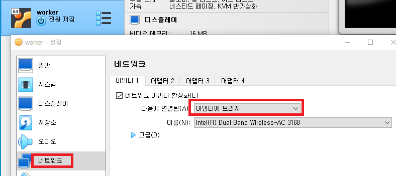
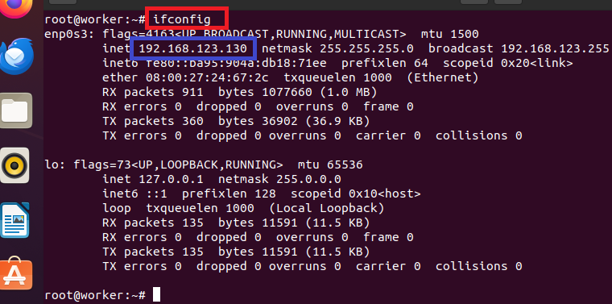
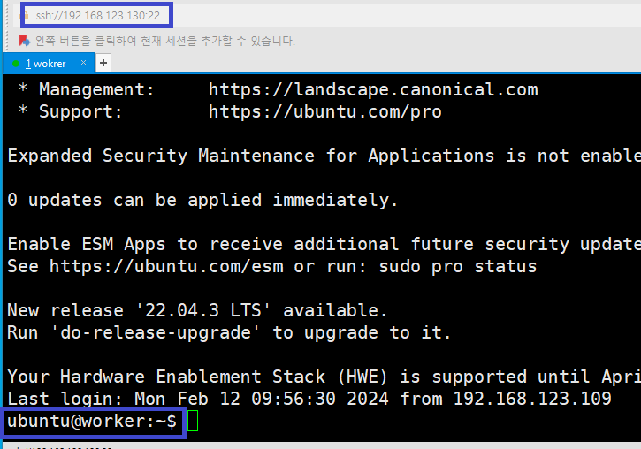

### 단계1: master를 이용하여 복제 


---
### 단계2: 스펙 확인 
- 기본메모리: 6144MB (추천: 8192MB)
- 프로세서: 3 (추천: 4)
- 저장소: 100GB


---
### 단계3: 네트워크 확인 > 어댑터에 브리지


---
### 단계4: hostname & 재기동 
```shell
sudo hostnamectl set-hostname worker
hostname
``` 


---
### 단계5: ssh start 
- xshell과 연결하기 위해서 실행 
```shell
sudo service ssh start
sudo systemctl status sshd
```


---
### 단계5: root 계정 접속 
```shell
sudo passwd root # 비번 설정 
su - root # root 계정 접속
```


---
### 단계6: ifconfig
- ip: 192.168.123.188
```shell
ifconfig
```


---
### 단계7: Xshell 접속 



