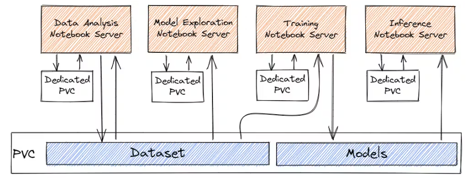

# [Noteboot Server](https://blog.kubesimplify.com/kubeflow-notebooks-ml-experimentation-made-easier-part-2)
Kubeflow Notebooks는 Pod 내에서 웹 기반 개발 환경을 실행하여 Kubernetes 클러스터 내에서 웹 기반 개발 환경을 실행하는 방법을 제공합니다.


---
### Kubeflow Notebooks 장점
- 노트북 컨테이너를 생성하고 로컬에서 실행하는 대신 클러스터에서 직접 실행할 수 있습니다.
- 사전 구성된 이미지 또는 사용자 정의 이미지를 사용하여 환경을 생성할 수 있으며, 이를 통해 환경이나 설치 문제가 아닌 현재 작업에 집중할 수 있습니다.
- JupyterLab, RStudio 및 VS Code를 즉시 지원하지만 다른 IDE도 사용할 수 있습니다.
- 마지막으로 Kubeflow의 역할 기반 액세스 제어 기능을 사용하면 쉽고 안전하게 노트북을 공유할 수 있습니다.

---
### Kubeflow Notebooks 스토리지 볼륨
- 각 노트북 컨테이너들은 PVC를 통해서 Dataset 및 Models 등을 공유할 수 있습니다. 



---
# [Noteboot Server 예제](https://v1-0-branch.kubeflow.org/docs/notebooks/setup/)

---
### 단계1: dashboard 접속
- dashboard 로그인
  - Email: user@example.com / Password: 12341234
- Notebooks > New Notebooks 클릭 


---
### 단계2: Notebooks 생성
- Name: my-notebook1
- image: jupyter-tensorflow-full:v1.6.0 
- CPU / RAM: 2 / 3


---
### 단계3: Notebooks 확인


---
### 단계4: Pod 확인 
```shell
kubectl get pod -n kubeflow-user-example-com
```


---
### 단계5: Notebooks 접속 
- my-notebook1 > connect


---
### 단계6: Nodebook 실행  


---
### 단계7: import tensorflow
```shell
import tensorflow as tf
tf.__version__
```


- https://www.youtube.com/watch?v=dlGulnj9-TY&list=PL6ZWs3MJaiphOwtHQvBCA4GNw-EPDely-&index=5

