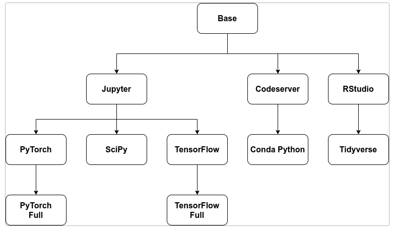
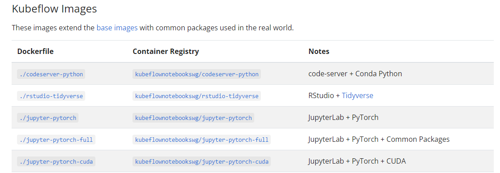
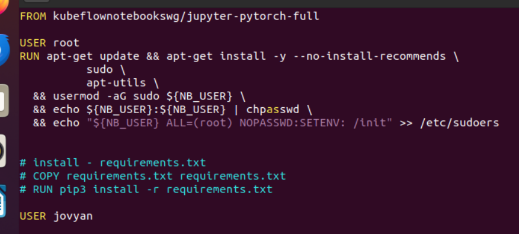
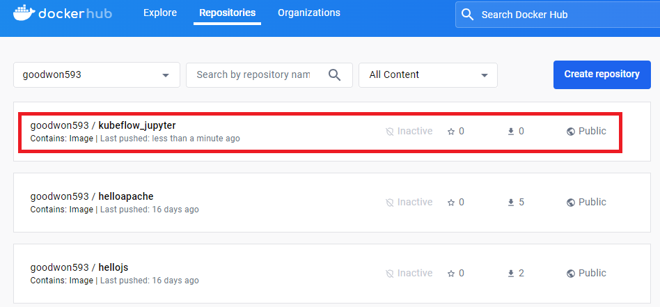
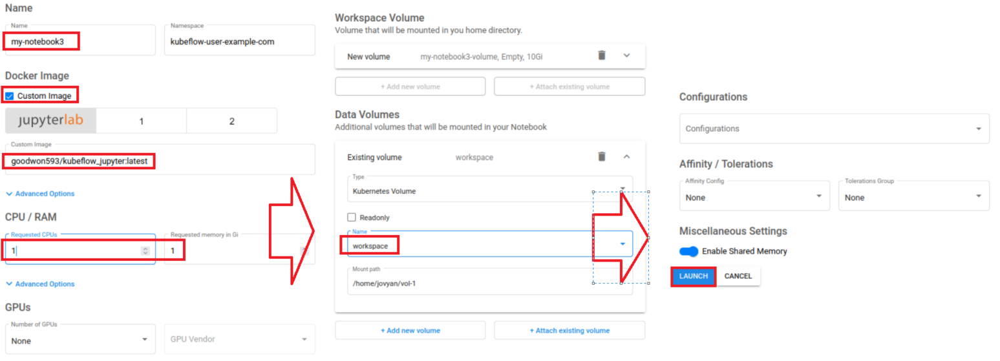

# [Kubeflow Image Dependency Chart](https://v1-5-branch.kubeflow.org/docs/components/notebooks/container-images/)


---
## [Kubeflow Dockerfiles](https://www.kubeflow.org/docs/components/notebooks/container-images/)
- kubeflow dockerfile을 이용하여 custom image를 생성할 수 있음



---
# 예제1
- docker/jupyter 폴더 참고 

---
### 단계1: Dockerfile 생성 
```shell
# 없으면, 생성: mkdir -p ~/kubeflow/noteboot/jupyter 
cd ~/kubeflow/noteboot/jupyter
# docker/jupyter 폴더 참고 
vim Dockerfile 
```


---
### 단계2: docker 로그인 
```shell
docker login
```


---
### 단계3: build Dockerfile > 이미지 생성
- 명령어: docker build -t <도커허브아이디>/<이미지명>:<테크> .
```shell
# 이미지 생성
docker build -t goodwon593/kubeflow_jupyter:latest .
# 이미지 확인
docker images
```


---
### 단계4: 도커허브로 이미지 업로드 
- 명령어: docker push <도커허브아이디>/<이미지명>:<테크>
```shell
docker push goodwon593/kubeflow_jupyter
```


---
### 단계5: 도커허브에서 이미지 업로드 확인 


---
### 단계6: Notebooks 생성
- Name: my-notebook3
- image: goodwon593/kubeflow_jupyter:latest 
- CPU / RAM: 1 / 1
- Data Volumes
  - 기존에 만든 workspace 적용

---



- https://www.youtube.com/watch?v=dlGulnj9-TY&list=PL6ZWs3MJaiphOwtHQvBCA4GNw-EPDely-&index=6


