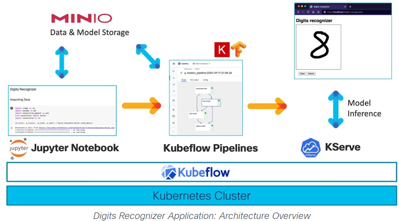
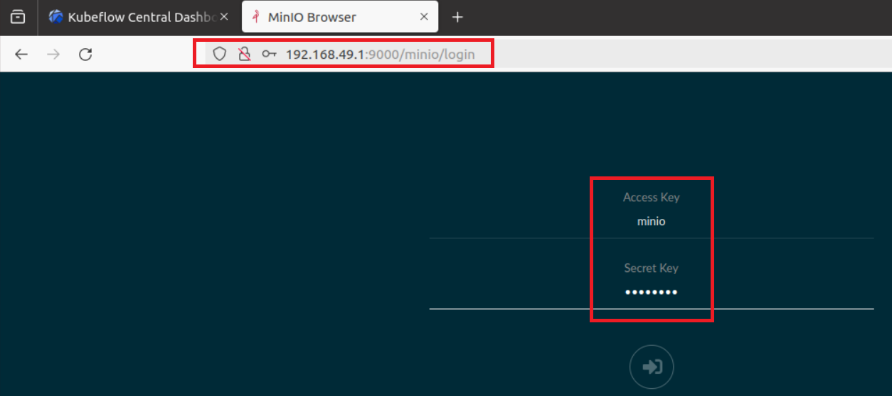
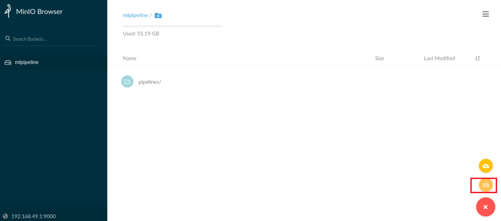
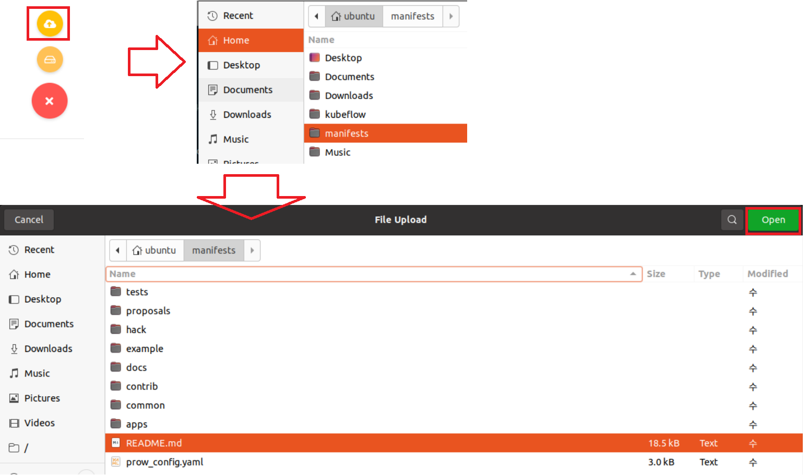
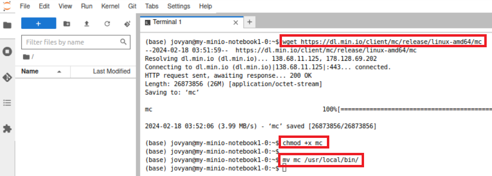
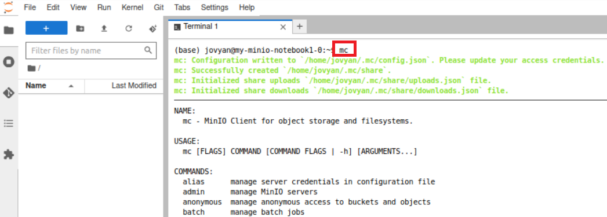
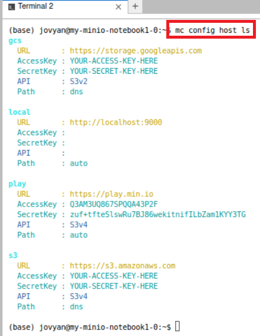
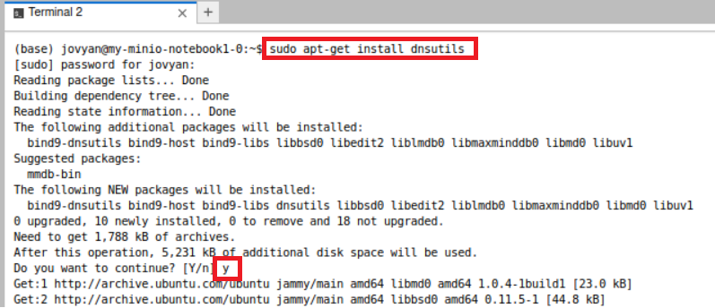
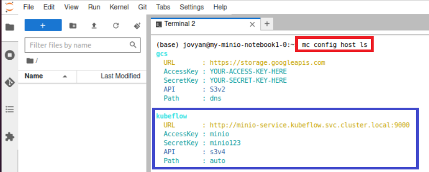
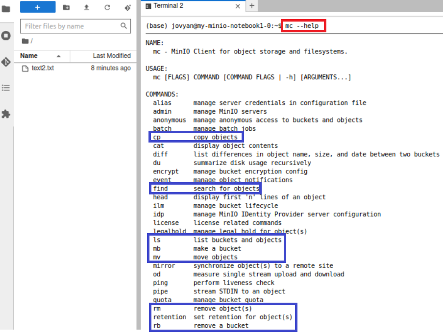

# MinIO
- 파이프라인 아키텍처의 기반은 공유 저장소입니다. 
- Kubeflow는 대규모 프라이빗 클라우드 인프라용으로 설계된 고성능 분산 객체 저장소인 MinIO를 제공합니다. 



---
# 예제1

---
### 단계1: ip 
- ip: 192.168.49.1
```shell
ifconfig
```


---
### 단계2: minio-service
- port: 9000
```shell
kubectl get svc -n kubeflow minio-service
```


### 단계3: port forward
```shell
kubectl port-forward --address="0.0.0.0" svc/minio-service -n kubeflow 9000:9000
```


---
### 단계4: minio ui
- 접속 url: http://<ip>:9000
    - http://192.168.49.1:9000
- Access Key / Secret Key: minio / minio123



---
### 단계5: Ceate bucket


---
- test-webconsol 생성 및 확인 


---
### 단계6: upload file


---
- 결과 확인 


---
# 예제2

---
### 단계1: Custom Image를 이용하여 Notebooks 생성
- Name: my-minio-notebook1
- image: goodwon593/kubeflow_jupyter:latest 
- CPU / RAM: 1 / 1


---
### 단계2: [MinIO Client 다운로드](https://github.com/minio/mc)
```shell
wget https://dl.min.io/client/mc/release/linux-amd64/mc
chmod +x mc
mv mc /usr/local/bin/
```


---
- MinIO Client 설치 확인 
```shell
mc
```


---
### 단계3: host 확인 
```shell
mc config host ls
```
- gcs: 구글에서 제공하는 storage
- local: 사용자가 설정한 storage
- play: Minio에서 제공하는 storage
- s3: aws에서 제공하는 storage



---
### 단계4: install dnsutils 
```shell
sudo apt-get install dnsutils
```


---
### 단계5: host add kubeflow 
- 명령어: mc config host add kubeflow http://minio-service.kubeflow.svc.cluster.local:9000 <Access Key> <Secret Key>
```shell
mc config host add kubeflow http://minio-service.kubeflow.svc.cluster.local:9000 minio minio123
```


---
- host 확인 
```shell
mc config host ls
```


---
### 단계6: bucket list 조회
- mlpipeline: 기본 bucket
- test-webconsol: 생성한 bucket
```shell
mc ls kubeflow
```


---
### 단계7: Ceate bucket 
- 명령어: mc mb kubeflow/<bucket명>
```shell
mc mb kubeflow/test-client
```


---
```shell
mc ls kubeflow
```

- minio ui


---
### 단계8: upload file
- 명령어: mc cp <파일명> kubeflow/<bucket명>
```shell
touch text2.txt

mc cp text2.txt kubeflow/test-client/
```


---
```shell
mc ls kubeflow/test-client
```

- minio ui


---
### 단계9: mc 명령어 확인 
```shell
mc --help
```


---
# 예제3
- jupyter/minio_pytho.ipynb 참고

---
### 단계1: minio_pytho.ipynb 생성 및 실행 


---
### 단계2: 결과 확인 


---
### 단계3: 기존 Notebooks & Volumes 삭제 
- 용량 또는 자원(CPU) 부족으로 문제가 발생할 수 있으므로 삭제 
- workspace 제외 


