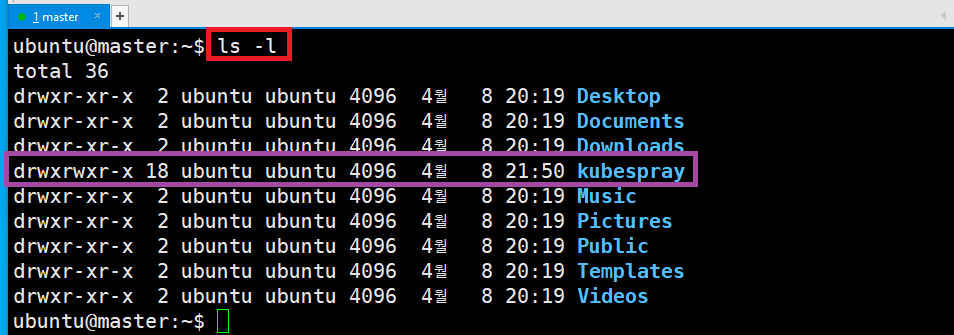
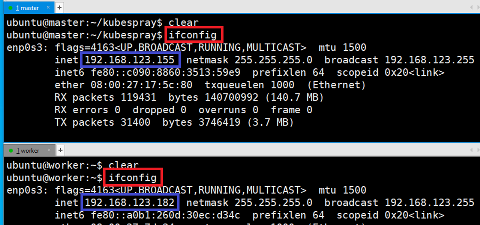
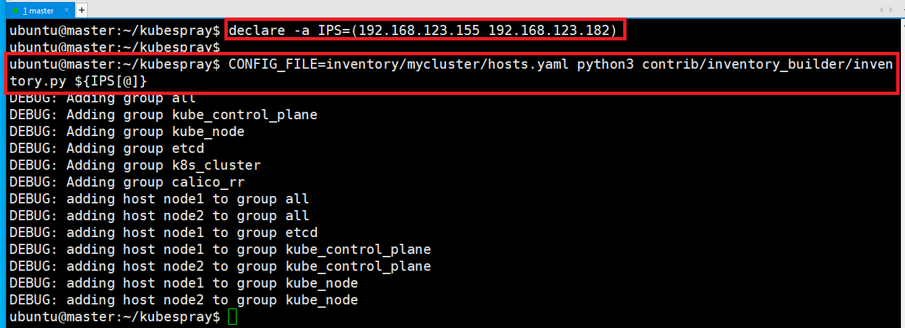
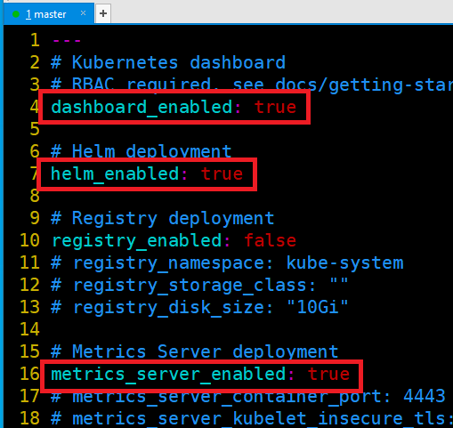
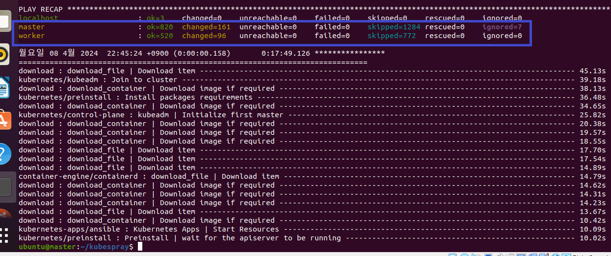

# master에만 적용 

---
### 단계1: python3 설치 
```shell
sudo apt-get install -y python3 python3-pip
pip3 install --upgrade pip
python3 --version
```


---
### 단계2: git 설치 
```shell
sudo apt-get install -y git
git --version
```


---
### 단계3: Kubespray 내려받기
```shell
git clone https://github.com/kubernetes-sigs/kubespray.git
```


---
- Kubespray 확인
```shell
ls -l
```


---
### 단계4: kube_version 변경 
- [kubeflow 호환버전으로 변경](https://www.kubeflow.org/docs/releases/kubeflow-1.8/)
```shell
cd kubespray
git switch release-2.21
```


---
### 단계5: [kube_version 확인](https://github.com/kubernetes-sigs/kubespray/blob/release-2.21/inventory/sample/group_vars/k8s_cluster/k8s-cluster.yml): v1.25.6
```shell
vim ./inventory/sample/group_vars/k8s_cluster/k8s-cluster.yml
```


---
### 단계6: 의존성 패키지들을 설치
- Kubespray에서 필요로 하는 의존성 패키지들을 설치해주자
```shell
pip3 install -r requirements.txt
```


---
### 단계7: 인벤토리 생성
- sample을 기반으로 나만의 설정을 업데이트해주면 된다.
```shell
cp -rfp inventory/sample inventory/mycluster
ls inventory
```


---
### 단계8: ip 확인
- master: 192.168.123.155
- worker: 192.168.123.182 



---
### 단계9: ip정보 업데이트
- master/worker ip 정보 확인 후 수정
```shell
declare -a IPS=(192.168.123.155 192.168.123.182)
CONFIG_FILE=inventory/mycluster/hosts.yaml python3 contrib/inventory_builder/inventory.py ${IPS[@]}
```


---
### 단계10: hosts.yaml
- hosts.yaml 파일 참고 
```shell
vim ./inventory/mycluster/hosts.yaml
```


---
### 단계11: addons.yaml
- Dashboard 설치 
- Helm 설치
```shell
vim ./inventory/mycluster/group_vars/k8s_cluster/addons.yml
# 아내 내용으로 수정 
dashboard_enabled: true
helm_enabled: true
metrics_server_enabled: true
```


---
### 단계12: k8s-cluster.yml
```shell
vim ./inventory/mycluster/group_vars/k8s_cluster/k8s-cluster.yml
# 아내 내용으로 수정
kube_proxy_mode: iptables
```


---
### 단계13: ansible 설치
- kubespray는 `ansible`을 기본으로 사용한다.
```shell
sudo apt-get install -y ansible python3-argcomplete
# 설치 확인 
ansible --version
```


---
### 단계14: 네트워크 통신 확인 
```shell
ansible all -m ping -i inventory/mycluster/hosts.yaml
```


---
### 단계15: kubernetes 설치 
- 설치는 오래 걸리기 때문에 virtualbox에서 진행 
```shell
cd ~/kubespray

ansible-playbook -i inventory/mycluster/hosts.yaml --become --become-user=root --extra-vars "ansible_sudo_pass=ubuntu" -b cluster.yml
```


---
### 단계16: 인증 정보 복사
- root 계정에 등록된 인증 정보를 복사해오면 된다.
```shell
mkdir -p ~/.kube

sudo cp -i /etc/kubernetes/admin.conf ~/.kube/config
sudo chown $(id -u):$(id -g) ~/.kube/config
ls -al ~/.kube/config
```


---
### 단계17: kubernetes 설치 확인
- node 확인  
```shell
kubectl get nodes -o wide
```


---
- pod 확인 
```shell
kubectl get pods -A
```


---
### 단계18: 자동완성
- bash 쉘 환경에서 자동완성 기능을 추가하려면 다음과 같이 하면 된다.
```shell
echo 'source <(kubectl completion bash)' >>~/.bashrc
source ~/.bashrc
# 자동완성 테스트 
kubectl api-re + `<tab키>` # 결과: kubectl api-resources
```


