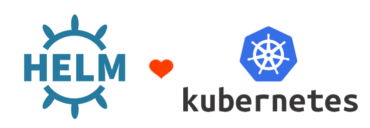
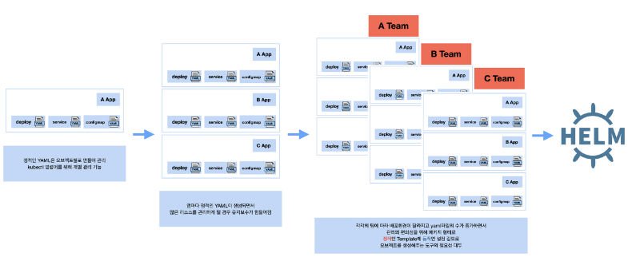

# Helm
- Helm은 deployment, service, ingress 등 yaml 파일들을 하나의 package로 관리하고자할 때 사용하는 도구이다.
- 기본적으로 배포한 애플리케이션을 사겢하기 위해선 deployment.yaml, service.yaml, ingress.yaml 등 따로 삭제해주어야 하지만 helm을 사용하게 되면 설치와 삭제 모두 한번에 가능해서 간편하다.



---
## Helm을 사용하는 이유 
- Infra 자원이 단순한 경우 kubectl 명령어를 통해 개별 오브젝트에 대한 설정과 관리는 충분히 가능하다. 하지만 앱이 증가하고 팀단위로 인프라가 확장될 경우 개별 오브젝트에 대한 YAML을 개별적으로 관리할 경우 관리에 어려움이 발생하게 된다. 
- 그래서 정적인 Template에 동적인 설정 값(Value)으로 오브젝트를 패키지 형태로 관리해주는 도구가 필요하게 되었고 HEML이 탄생하였다. 



---
## 주요 개념 3가지 
### 1. Chart
- helm package에 해당하는 부분으로 이 패키지에는 kubernetes Cluster 내에서 애플리케이션 툴, 서비스를 구동하는데 필요한 모든 Resource가 정의되어 있습니다.
- 즉, Chart는 templates으로 설치하고자 하는 쿠버네티스 리소스의 설치 스크립트라고 볼 수 있습니다. 

---
### 2. Repository
- Chart를 모아두고 공유하는 공간입니다.
### 3. Release
- kubernetes Cluster에서 구동되는 Chart의 인스턴스입니다.
- 일반적으로 하나의 Chart는 동일한 Cluster 내에 여러 번 설치될 수 있습니다. 이때 설치될 때마다 새로운 Relase가 생성됩니다. 

---
## 유용한 싸이트 
### [Helm 공식 싸이트](https://helm.sh/ko/docs/)

### [Helm Charts](https://bitnami.com/stacks/helm)

---
## Helm 설치 확인 
- 만약 설치가 안되었다면, [Helm 설치 방법](https://helm.sh/ko/docs/intro/install/)
```shell
helm --help
```


---
## Helm 자동완성
```shell
source <(helm completion bash)
echo "source <(helm completion bash)" >> ~/.bashrc

# 테스트 
helm rep +[Tab키]
```


---
# Helm 구성하기 

---
### 단계1: Repository list
- 등록된 Repository가 없음 
- Helm을 사용하기 위해서 Repository 등록 필요
```shell
helm repo list
```


---
- https://www.youtube.com/watch?v=QlYgYcJ-GhA&list=PLApuRlvrZKohLYdvfX-UEFYTE7kfnnY36&index=13

- 14:42 시간대...


