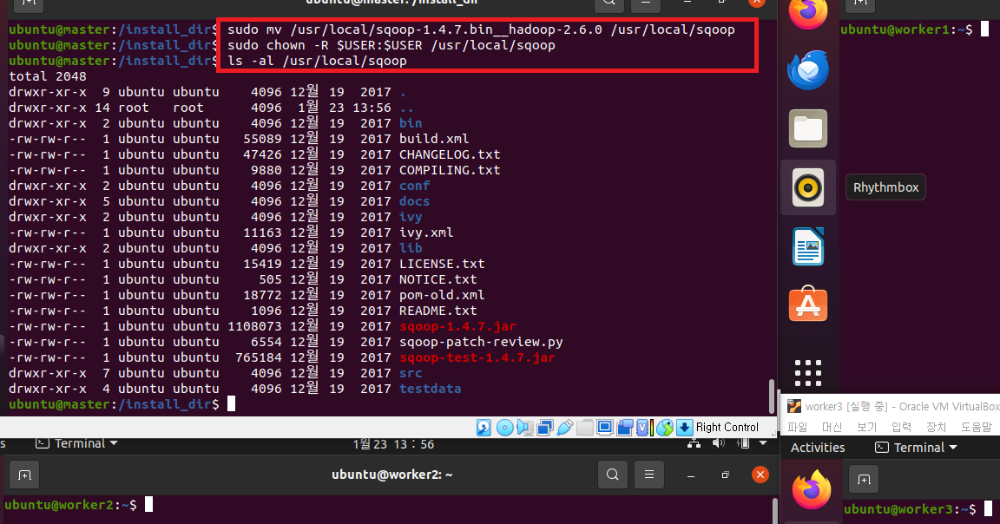
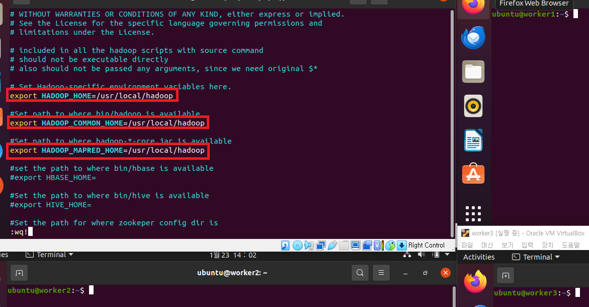
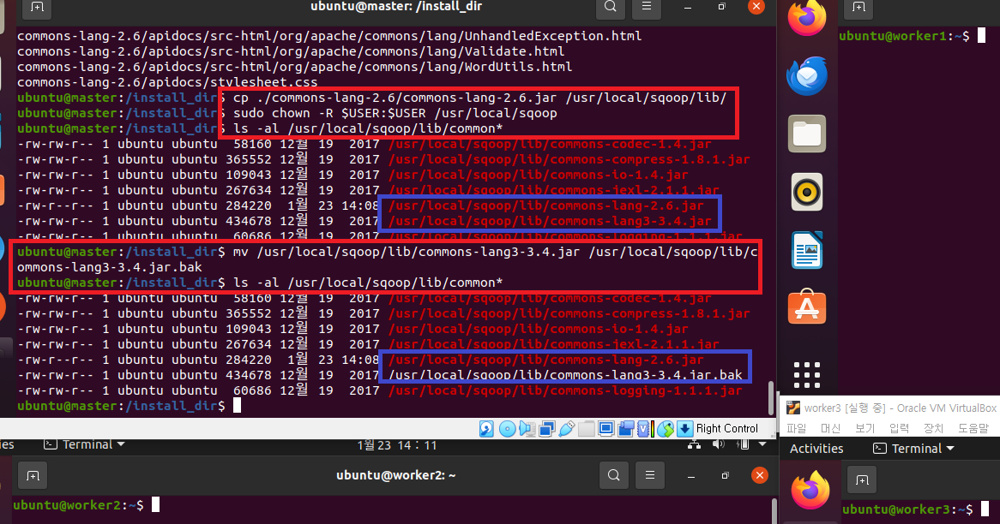
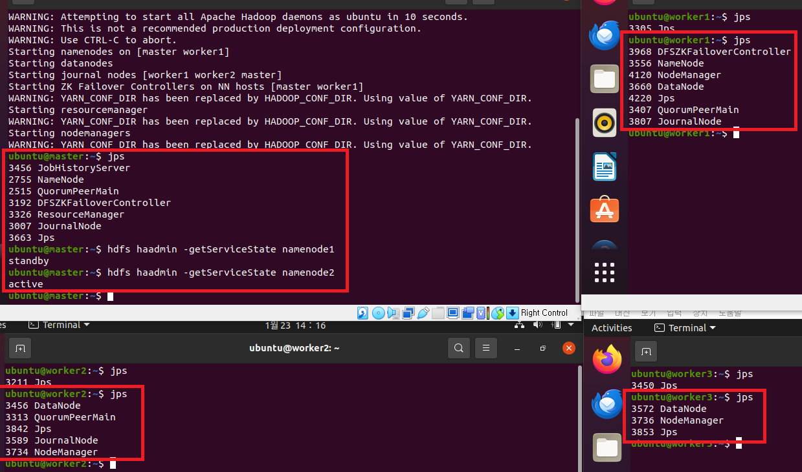
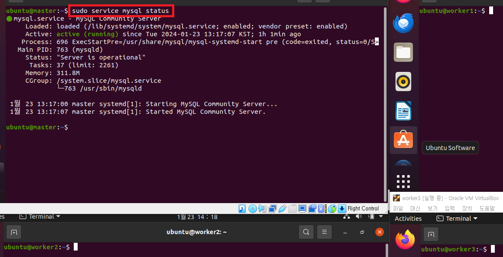

### 단계1: sqoop 설치
```shell
cd /install_dir
sudo wget https://archive.apache.org/dist/sqoop/1.4.7/sqoop-1.4.7.bin__hadoop-2.6.0.tar.gz

# sqoop 압출풀기
sudo tar -zxvf sqoop-1.4.7.bin__hadoop-2.6.0.tar.gz -C /usr/local
# 폴더 변경
sudo mv /usr/local/sqoop-1.4.7.bin__hadoop-2.6.0 /usr/local/sqoop
# owner(소유권)를 변경 
sudo chown -R $USER:$USER /usr/local/sqoop
# 결과 확인 
ls -al /usr/local/sqoop
```
---


---
### 단계2: 환경설정
```shell
sudo vim ~/.bashrc
# 아래 내용 복사 
export SQOOP_HOME=/usr/local/sqoop
export SQOOP_CONF_DIR=$SQOOP_HOME/conf
export PATH=$PATH:$SQOOP_HOME/bin

# 수정내용 반영 
source ~/.bashrc
env | grep sqoop
```
---


---
### 단계3: sqoop-env.sh
```shell
cd $SQOOP_CONF_DIR 
cp sqoop-env-template.sh sqoop-env.sh

vim sqoop-env.sh 

# 아래내용 수정 
export HADOOP_HOME=/usr/local/hadoop
export HADOOP_COMMON_HOME=/usr/local/hadoop
export HADOOP_MAPRED_HOME=/usr/local/hadoop
```
---


---
### 단계4: MySQL JDBC Connector
```shell
cd /install_dir
ls 
# 만약 mysql-connector-java-8.0.22.jar 없다면, 실행 
sudo wget https://repo1.maven.org/maven2/mysql/mysql-connector-java/8.0.22/mysql-connector-java-8.0.22.jar

cp mysql-connector-java-8.0.22.jar /usr/local/sqoop/lib/
sudo chown -R $USER:$USER /usr/local/sqoop
ls -al /usr/local/sqoop/lib/mysql*
```
---


---
### 단계5: commons-lang
```shell
cd /install_dir
sudo wget https://mirror.navercorp.com/apache//commons/lang/binaries/commons-lang-2.6-bin.tar.gz

sudo tar -zxvf commons-lang-2.6-bin.tar.gz -C /install_dir
cp ./commons-lang-2.6/commons-lang-2.6.jar /usr/local/sqoop/lib/

sudo chown -R $USER:$USER /usr/local/sqoop
mv /usr/local/sqoop/lib/commons-lang3-3.4.jar /usr/local/sqoop/lib/commons-lang3-3.4.jar.bak
ls -al /usr/local/sqoop/lib/common*
```
---


---
### 단계6: 하둡 실행 
```shell
# 하둡 실행 
. cluster-start-all.sh

hdfs haadmin -getServiceState namenode1
hdfs haadmin -getServiceState namenode2

jps
```
---


---
### 단계7: MySQL
```shell
# running 유무 확인
sudo service mysql status
# (옵션)서버 재실행 
sudo service mysql restart
```
---


---
### 단계8: Sqoop 설치 확인 
```shell
sqoop help
```


